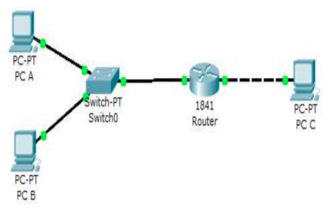

# Review Konsep Jaringan

## Tujuan

-	Memahami konsep jaringan. 
-	Pengalamatan jaringan dan cara mendesain jaringan.
-	Mengkonfigurasi dan menguji jaringan sederhana

##Petunjuk

-	Awali setiap sebelum membuat projek dengan berdoa.
-	Baca dan pahami tujuan, dasar teori, dan latihan-latihan modul dengan baik.
-	Kerjakan tugas-tugas projek dengan baik, sabar dan jujur.

##Ulasan Teori

Dalam  ilmu  komputer  dan  teknologi  informasi,  dikenal  istilah  jaringan  komputer. Jaringan  komputer  adalah  sekumpulan  komputer  yang  dapat  saling  berhubungan  antara satu dengan lainnya dengan menggunakan media komunikasi, sehingga dapat saling berbagi data, informasi, program, dan perangkat keras (printer, harddisk, webcam, dsb).   
Komputer-komputer  tersebut  bisa  saja  memiliki  tipe  yang  berbeda-beda, menggunakan  sistem  operasi  yang  berbeda,  dan  menggunakan  program/aplikasi  yang berbeda pula. Tetapi komputer-komputer  yang  terhubung dalam  jaringan  komputer harus memakai aturan komunikasi (protokol) yang sama. Hal ini dimaksudkan agar masing-masing komputer dapat berkomunikasi dengan komputer lainnya. Protokol yang menjadi Standar Internasional adalah TCP/IP (Transmission Control Protocol / Internet Protocol).

###Definisi Jaringan Komputer

Untuk memahami istilah jaringan komputer sering kali kita dibingungkan dengan sistem terdistribusi (distributed system). Kunci perbedaannya adalah bahwa sebuah sistem terdistribusi, keberadaan sejumlah komputer autonomous bersifat transparan bagi pemakainya. Seseorang dapat memberi perintah untuk mengeksekusi suatu program, dan kemudian program itupun akan berjalan dan tugas untuk memilih prosesor, menemukan dan mengirimkan file ke suatu prosesor dan menyimpan hasilnya di tempat yang tepat merupakan tugas sistem operasi. Dengan kata lain, pengguna sistem terditribusi tidak akan menyadari terdapatnya banyak prosesor (multiprosesor), alokasi tugas ke prosesor-prosesor, alokasi file ke disk, pemindahan file yang disimpan dan yang diperlukan, serta fungsi-fungsi lainnya dari sitem harus bersifat otomatis.

###Manfaat Jaringan Komputer

Sebelum membahas kita masalah-masalah teknis lebih mendalam lagi, perlu kiranya diperhatikan hal-hal yang membuat orang tertarik pada jaringan komputer dan untuk apa jaringan ini digunakan. Manfaat jaringan komputer bagi manusia dapat dikelompokkan pada jaringan untuk perusahaan, jaringan untuk umum, dan masalah sosial jaringan.

###Macam Jaringan Komputer

Dalam mempelajari macam-macam jaringan komputer terdapat dua klasifikasi yang sangat penting yaitu teknologi transmisi dan jarak. Secara garis besar, terdapat dua jenis teknologi transmisi yaitu jaringan broadcast dan jaringan point-to-point.

-   Jaringan broadcast

    Memiliki saluran komunikasi tunggal yang dipakai bersama-sama oleh semua mesin yang ada pada jaringan. Pesan-pesan berukuran kecil, disebut paket, yang dikirimkan oleh suatu mesin akan diterima oleh mesin-mesin lainnya. Field alamat pada sebuah paket berisi keterangan tentang kepada siapa paket tersebut ditujukan.
-   Jaringan point-to-point

    Terdiri dari beberapa koneksi pasangan individu dari mesin-mesin. Untuk mengirim paket dari sumber ke suatu tujuan, sebuah paket pada jaringan jenis ini mungkin harus melalui satu atau lebih mesin-mesin perantara. Seringkali harus melalui banyak route yang mungkin berbeda jaraknya. Karena itu algoritma route memegang peranan penting pada jaringan point-to-point.
    
Kriteria alternatif untuk mengklasifikasikan jaringan adalah didasarkan pada jaraknya.

-   Personal Area Network (PAN)

    PAN adalah jaringan komputer yang digunakan untuk komunikasi antara komputer perangkat (termasuk telepon dan asisten pribadi digital) dekat dari satu orang. Perangkat mungkin atau tidak milik orang tersebut. Jangkauan dari PAN biasanya beberapa meter. PANs dapat digunakan untuk komunikasi antara perangkat pribadi mereka sendiri (intrapersonal komunikasi), atau untuk menghubungkan ke tingkat yang lebih tinggi dan jaringan Internet (an uplink). 
    
    Personal area jaringan kabel mungkin dengan komputer bus seperti USB dan FireWire. A wireless personal area network (WPAN) juga dapat dimungkinkan dengan teknologi jaringan seperti IrDA, Bluetooth, UWB, Z-Wave dan ZigBee.
-   Local Area Network (LAN)

    LAN merupakan jaringan milik pribadi di dalam sebuah gedung atau kampus yang berukuran sampai beberapa kilometer. LAN seringkali digunakan untuk menghubungkan komputer-komputer pribadi dan workstation dalam kantor perusahaan atau pabrik-pabrik untuk memakai bersama resource (misalnya, printer, scanner) dan saling bertukar informasi. LAN dapat dibedakan dari jenis jaringan lainnya berdasarkan tiga karakteristik: ukuran, teknologi transmisi dan topologinya.
    
    LAN mempunyai ukuran yang terbatas, yang berarti bahwa waktu transmisi pada keadaan terburuknya terbatas dan dapat diketahui sebelumnya. Dengan mengetahui keterbatasnnya, menyebabkan adanya kemungkinan untuk menggunakan jenis desain tertentu. Hal ini juga memudahkan manajemen jaringan.
-   Metropolitan Area Network (MAN)

    MAN pada dasarnya merupakan versi LAN yang berukuran lebih besar dan biasanya memakai teknologi yang sama dengan LAN. MAN dapat mencakup kantor-kantor perusahaan yang berdekatan dan dapat dimanfaatkan untuk keperluan pribadi (swasta) atau umum. MAN biasanya mamapu menunjang data dan suara, dan bahkan dapat berhubungan dengan jaringan televisi kabel. MAN hanya memiliki sebuah atau dua buiah kabel dan tidak mempunyai elemen switching, yang berfungsi untuk mengatur paket melalui beberapa output kabel. Adanya elemen switching membuat rancangan menjadi lebih sederhana.
-   Wide Area Network (WAN)

    WAN mencakup daerah geografis yang luas, sertingkali mencakup sebuah negara atau benua. WAN terdiri dari kumpulan mesin yang bertujuan untuk mejalankan program-program aplikasi.
    
    Mesin-mesin ini sebagai host. Istilah End System kadang-kadang juga digunakan dalam literatur. Host dihubungkan dengan sebuah subnet komunikasi, atau cukup disebut subnet. Tugas subnet adalah membawa pesan dari host ke host lainnya, seperti halnya sistem telepon yang membawa isi pembicaraan dari pembicara ke pendengar. Dengan memisahkan aspek komunikasi murni sebuah jaringan (subnet) dari aspek-aspek aplikasi (host), rancangan jaringan lengkap menjadi jauh lebih sederhana.
    
    Pada sebagian besar WAN, subnet terdiri dari dua komponen, yaitu kabel transmisi dan elemen switching. 

###Jaringan Tanpa Kabel

Komputer mobile seperti komputer notebook dan personal digital assistant (PDA), merupakan cabang industri komputer yang paling cepat pertumbuhannya. Banyak pemilik jenis komputer tersebut yang sebenarnya telah memiliki mesin-mesin desktop yang terpasang pada LAN atau WAN tetapi karena koneksi kabel tidaklah mungkin dibuat di dalam mobil atau pesawat terbang, maka banyak yang tertarik untuk memiliki komputer dengan jaringan tanpa kabel ini.

Jaringan tanpa kabel mempunyai berbagai manfaat, yang telah umum dikenal adalah kantor portable. Orang yang sedang dalam perjalanan seringkali ingin menggunakan peralatan elektronik portable-nya untuk mengirim atau menerima telepon, fax, e-mail, membaca fail jarak jauh login ke mesin jarak jauh, dan sebagainya dan juga ingin melakukan hal-hal tersebut dimana saja, darat, laut, udara. Jaringan tanpa kabel sangat bermanfaat untuk mengatasi masalah-masalah di atas.

##Langkah Praktikum

Pada praktikum kali ini, untuk mengingatkan kembali konsep jaringan ikuti langkah-langkah berikut:
1.  Lakukan instalasi Paket Tracer.
2.  Buatlah topopogi jaringan seperti berikut:
 
    <figure>
              
              <figcaption style="text-align: center">Topologi Jaringan</figcaption>
    </figure>

##Tugas

Untuk mengingat kembali konsep jaringan komputer maka kerjakanlah beberapa soal berikut berdasarkan jaringan yang Anda buat dalam langkah praktikum di atas!

1.  Ada berapa jaringankah yang ada pada diagram jaringan di atas ?
2.	Perlukah router diberi konfigurasi routing agar jaringan-jaringan yang terkoneksi langsung dengan dirinya bisa saling berkomunikasi? Sebutkan alasannya!
3.	Untuk masing-masing host (PC A, PC B & PC C ), berikan alokasi pengalamatan agar diagram jaringan di atas bisa saling berkomunikasi. Dengan format :
  
      PC A :
      
      IP address : ....
        
      Subnet mask : ...
        
      Gateway :....
        
      Network ID : ...
    
4.	Berikan konfigurasi pengalamatan untuk masing-masing interface fastethernet Router, dengan asumsi fastEthernet 0/0 terhubung ke switch, dan fastEthernet 0/1 terhubung langsung ke PC C.
    
        Router fastEthernet 0/0 :
        -   Ip Address : ...
        -   Subnet mask : ...
        
        Router fastEthernet 0/1 :
        -   IP Address : ...
        -   Subnet mask : ...

5.	Kabel jenis bagaimanakah yang digunakan untuk menghubungkan masing-masing perangkat pada diagram jaringan di atas ? (Straight, Cross atau Rollover)
       -   PC A – Switch : ...
       -   PC B - Switch : ...
       -   Switch – Router : ...
       -   Router – PC C : ... 
6.	Perintah apakah yang dapat digunakan untuk mengecek koneksi antar host yang ada ?
