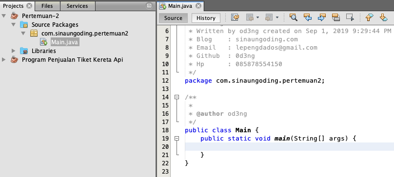

#INTERNET ADDRESS

##Tujuan

-   Memahami struktur alamat IP dan DNS.
-   Memahami dan mampu menerapkan class InetAddress.

##Petunjuk

-   Awali setiap sebelum membuat projek dengan berdoa.
-	Baca dan pahami tujuan, dasar teori, dan latihan-latihan modul dengan baik.
-	Kerjakan tugas-tugas projek dengan baik, sabar dan jujur

##Ulasan Teori

Host adalah perangkat yang terhubung dalam suatu jaringan komputer. Host dapat berupa komputer, router, IP kamera, IP printer, akses poin, perangkat genggam, dan lain sebagainya. Setiap host dalam jaringan internet atau TCP/IP diidentifikasikan dengan alamat unik yang terdiri dari 4 byte Internet Protocol
(IP).

Setiap alamat IP dituliskan perbagiannya dipisahkan dengan titik, dengan contoh format 192.168.1.10, di mana setiap bagian (byte) – nya menggunakan integer positif antara 0 sampai 255. Sehingga ada sekitar 4 milyar alamat IP yang bisa dibuat secara unik. Walaupun begitu, saat ini jumlah sedemikian itu tidaklah cukup dibagi untuk perangkat-perangkat atau host yang ada dan terus diproduksi saat ini.

Sehingga solusinya adalah penggunaan IPv6 yang terdiri dari 128 bit alamat, yang artinya 4x lebih banyak dari IPv4 yang hanya terdiri dari 32 bit (4 byte) alamat. Saat ini, tidak semua ISP menerapkan IPv6 pada jaringan yang dikelolanya.

###IPv4

IP Address merupakan pengenal yang digunakan untuk memberi alamat pada tiap-tiap computer dalam jaringan. Format IP Address adalah bilangan 32 bit yang tiap 8 bitnya dipisahkan oleh tanda titik. Format IP Address dapat berupa biner (xxxxxxxx.xxxxxxx.xxxxxxxx.xxxxxxx) atau berupa bilangan desimal yang masing-masing dipisahkan oleh titik (dotted decimal) (xxx.xxx.xxx.xxx).

IP address merupakan bilangan biner 32 bit yang dipisahkan oleh tanda pemisah berupa tanda titik disetiap 8 bitnya. Tiap 8 bit ini disebut dengan oktet.
Bentuk dari IP address adalah sebagai berikut:

    xxxxxxxx.xxxxxxxx.xxxxxxxx.xxxxxxxx
    132.           92           121          1                Dotted Decimal Notation

Pembagian kelas-kelas IP berdasarkan pada dua hal: Network ID dan host ID dari suatu IP. Network ID adalah bagian dari IP address yang digunakan untuk menunjuk jaringan tempat komputer ini berada. Host ID adalah bagian dari IP Address yang digunakan untuk menunjuk workstation, server, router dan semua host TCP/IP lainnya dalam jaringan tersebut.
Dikenal dua cara pembagian IP address:
- Classfull Addressing
- Classless Addressing

###Classfull Addressing

Merupakan metode pembagian IP berdasarkan kelas dimana IP Address dibagi menjadi 5 kelas
- Kelas A

        Format          :0nnnnnnn.hhhhhhhh.hhhhhhhh.hhhhhhhh
        Bit pertama     :0
        Panjang NetID   :8 bit
        Panjang HostID  :24 bit
        Byte Pertama    :0-127
        Jumlah          :126 Kelas A(0 dan 127 dicadangkan)
        Range IP        :1.xxx.xxx.xxx-126.xxx.xxx.xxx
        Jumlah IP       :16.777.214 IP Address disetiap kelas
        Deskripsi       :Diberikan untuk host dengan jumlah yang besar
        
- Kelas B

        Format          :10nnnnnn.nnnnnnnn.hhhhhhhh.hhhhhhhh
        Bit pertama     :10
        Panjang NetID   :16 bit
        Panjang HostID  :26 bit
        Byte Pertama    :128-191
        Jumlah          :16384 Kelas B
        Range IP        :128.0.xxx.xxx-191.155.xxx.xxx
        Jumlah IP       :65.532 IP Address disetiap kelas B
        Deskripsi       :Dialokasikan untuk jaringan besar dan sedang

- Kelas C

        Format          :110nnnnn.nnnnnnnn.hhhhhhhh.hhhhhhhh
        Bit pertama     :110
        Panjang NetID   :24 bit
        Panjang HostID  :8 bit
        Byte Pertama    :192-223
        Jumlah          :2.097.152 Kelas B
        Range IP        :192.xxx.xxx.xxx-223.255.255.xxx
        Jumlah IP       :254 IP Address disetiap kelas C
        Deskripsi       :Dialokasikan untuk jaringan berukuran kecil

- Kelas D

        Format          :1110nnnn.nnnnnnnn.hhhhhhhh.hhhhhhhh
        Bit pertama     :1110
        Bit Multicast   :28 bit
        Byte Inisial    :224-247
        Deskripsi       :Kelas D digunakan untuk keperluan IP Multicast

- Kelas E

        Format          :1111rrrr.rrrrrrrr.rrrrrrrr.rrrrrrrr
        Bit pertama     :1111
        Bit Multicast   :28 bit
        Byte Inisial    :248-255
        Deskripsi       :Kelas E dicadangkan untuk keperluan experimen

###Classless Addressing

Merupakan metode pengalamatan tanpa kelas, yakni dengan mengalokasikan IP Address dalam notasi Classless Inter Domain Routing (CIDR). Proses memilih Network ID dan Host ID yang tepat untuk suatu jaringan. IP Address terdiri dari 2 bagian, yaitu:
- Network ID:Menunjuk nomor network
- Host ID	:Mengindentifikasi host dalam satu network

Beberapa aturan dasar dalam menentukan network ID dan host ID yang hendak digunakan:
- Network ID 127.0.0.1 tidak dapat digunakan, karena merupakan default yang digunakan untuk keperluan menunjuk dirinya sendiri (loop-back).
- Host ID tidak boleh diset 1 (ex. 126.255.255.255), karena akan diartikan sebagai alamat broadcast. ID broadcast merupakan alamat yang mewakili seluruh anggota pada jaringan.
- Network ID dan Host ID tidak boleh sama dengan 0 (ex. 0.0.0.0), karena IP address dengan host ID 0 diartikan sebagai alamat network. Alamat network adalah alamat yang digunakan untuk menunjuk suatu jaringan, dan tidak menunjuk suatu host.
- Host ID harus unik dalam suatu network. Dalam suatu network tidak boleh ada dua host dengan host ID yang sama.

Aturan lain:
- 0/8 : 0.0.0.1 s/d 0.255.255.254
	
	Host/net : 16.777.214
	
- 10/8: 10.0.0.1 s/d 10.255.255.254

	Host/net : 16.777.214
	
- 127/8: 127.0.0.1 s/d 127.255.255.254

	Host/net : 16.777.214
	
- 169.254/16: 169.254.0.1 s/d 169.255.255.254

	Host/net : 65.534
	
- 172.16/12: 172.16.0.1 s/d 172.31.255.254

	Host/net : 1.048.574 (Private Internet)
	
- 192.0.2/24: 192.0.2.1 s/d 192.0.2.254

    Host/net : 254
    	
- 192.168/16: 192.168.0.1 s/d 192.168.255.254

    Host/net :65534
    	
- Semua space dari kelas D dan E dapat digunakan untuk IP Address Local Area Network, karena IP ini tidak digunakan di internet

###Subnet

Konsep Subnetting dari IP Address merupakan teknik yang umum digunakan di internet untuk mengefisienkan alokasi IP Address dalam sebuah jaringan supaya bisa memaksimalkan IP Address. Subnetting merupakan proses memecah satu kelas IP Address menjadi beberapa subnet dengan jumlah host yang lebih sedikit, dan untuk menentukan batas network ID dalam suatu subnet, digunakan subnet mask.
Contoh subnet:

<figure style="text-align: center">
    <figcaption style="text-align: center">Contoh Subnet</figcaption>
    
</figure>

<figure style="text-align: center">
    <figcaption style="text-align: center">Tabel Subnet</figcaption>
    
</figure>

###Subnetting

Jumlah Host per Network 2n -2,
n adalah jumlah bit tersisa sebelum diselubungi. Contoh: network prefix /10 maka bit tersisa adalah 32-10=22

222 -2=4194302

Jumlah subnet = 2 N

Dimana N adalah jumlah bit yang dipergunakan.

N=network prefix-8

Contoh: network prefix /10, maka

N=10-8 = 2

22 =4

<figure style="text-align: center">
    
    <figcaption style="text-align: center">Tabel Subnetting Ip Kelas C</figcaption>
</figure>

###DNS

Alamat IP yang berbentuk numerik dapat pula dipetakan dalam bentuk nama untuk kemudahan pemakaian oleh user, seperti www.google.com, mail.yahoo.com, dan lain sebagainya.

Alamat IP yang berbentuk numerik dapat pula dipetakan dalam bentuk nama untuk kemudahan pemakaian oleh user, seperti www.google.com, mail.yahoo.com, dan lain sebagainya.

###Alamat IP dan JAVA

Java memiliki klas untuk mendefinisikan alamat IP, yaitu class `java.net.InetAddress`. Kelas ini memiliki tiga fungsi :
- Mengenkapsulasi mengenkapsu alamat
- Melakukan name-lookup name lookup (mengkonversi nama host ke alama IP)
- Melakukan reverse-lookup (mengkonversi alamat IP ke nama host)
Objek dari class tersebut tidaklah dibuat dengan memanggil konstruktor classnya. Tidak ada konstuktor dari class InetAddress. Melainkan dengan memanggil method static dari class ini. Yaitu:
- `public static InetAddress getByName(String host) throws UnknownHostException`
- `public static InetAddress[ ] getAllByName(String host) throws UnknownHostException` 
- `public static InetAddress getLocalHost() throws UnknownHostException`

Setiap pembuatan objek dengan menggunakan method static di atas membutuhkan pengecekan dengan DNS. Pada java 1.4 ditambahkan method static untuk pembuatan objek dari class InetAddress yang tidak membutuhkan pengecekan dengan DNS lokal. Yaitu dengan menggunakan method:

- `public static InetAddress getByAddress(byte[ ] address) throws UnknownHostException` 
- `public static InetAddress getByAddress(String hostName, byte[] address) throws UnknownHostException`

Selain method untuk menginstansi objek, class InetAddress memiliki method getter untuk memanggil nama host dalam bentuk String dan alamat IP dalam bentuk String atau array byte. 
- `public String getHostName()`
- `public byte[] getAddress()`
- `public String getHostAddress()`

##Langkah Praktikum

Lakukan instalasi Netbeans di computer Anda, kemudian buatlah sebuah project baru seperti berikut:
1. Klik menu File >> New Project atau menggunakan shortcut dengan menekan kombinai tombol Ctrl + Shift + N atau dengan cara meng-Klik icon New Project pada toolbar.
2. Pada jendela New Project dibagian Categories silahkan anda pilih sesuai dengan kebutuhan anda. Disini saya memilih java. Dan dibagian Projects saya memilih java application. Setelah itu klik Next.
    
    <figure>
              
              <figcaption style="text-align: center">Menu Netbeans</figcaption>
    </figure>

3. Pada jendela New Java Application dibagian Project Name silahkan anda isi nama project anda. Sebagai Contoh disini saya isi dengan nama “Programku”. Dibagian project location adalah tempat penyimpanan project anda. Anda bisa merubahnya sesuai dengan keinginan anda. Tapi disini saya biarkan default aja. Dibagian Create Main Class, jika project yang anda buat ingin dijadikan sebagai main class atau kelas utama jangan hilangkan centangnya. Jika tidak, maka hilangkan centangnya. Disini saya jadikan sebagai main class. Jadi centangnya biarkan saja. Selanjutnya klik Finish
    
    <figure>
          
          <figcaption style="text-align: center">Menu membuat project baru</figcaption>
    </figure>
    
4. Setelah anda mengklik Finish, pembuatan project baru sudah selesai dan akan tampil seperti pada gambar dibawah ini:
    
    <figure>
          
          <figcaption style="text-align: center">Editor Netbeans</figcaption>
    </figure>

5. Buatlah contoh penggunaan class InetAddress pada komputer yang terkoneksi dengan jaringan Internet adalah sebagai berikut:
    
    <figure>
      
      <figcaption style="text-align: center">Contoh kode</figcaption>
    </figure>

##Tugas

Kerjakan soal berikut:
1. IP kelas C 202.152.0.1/27.  Tentukan berapa jumlah host maximal yang bisa disusun dalam jaringan dan berapa jumlah subnetnya. Ketentuan program adalah sebagai berikut:

    - Setelah berhasil menghitung menggunakan manual, silakan dibuat programnya menggunakan GUI(Swing).
    - Dalam program yang Anda buat terdapat untuk validasi ip address ketika penggunaa menginputkan bukan format ip address

2. Buatlah program untuk mendeteksi sebuah IP termasuk kelas A, B, C, D atau E. Ketentuan program adalah sebagai berikut:
    
    - Program harus menggunakan mode GUI(Swing)
    - Terdapat validasi input format ip address

3. Buatlah program untuk mendeteksi IP dari sebuah alamat URL! Ketentuan program adalah sebagai berikut:

    - Program harus menggunakan mode GUI(Swing)
    - Terdapat validasi input sebuah URL
