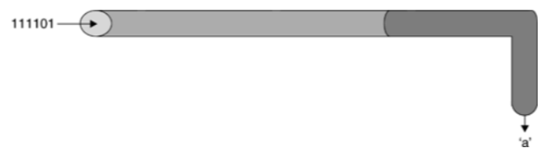
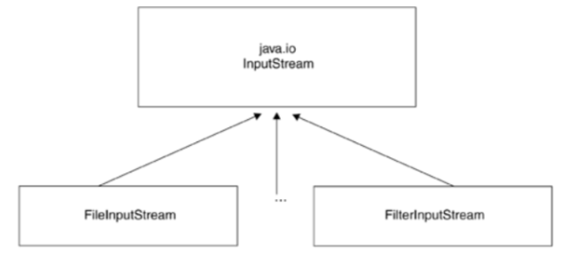
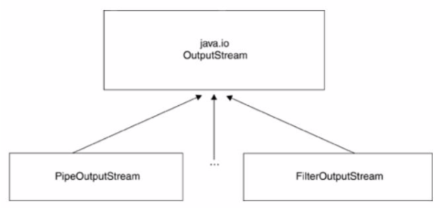

# STREAM

## Tujuan

-   Memahami konsep stream.
-   Menerapkan class stream di bahasa pemrograman Java.

## Petunjuk

-   Awali setiap sebelum membuat projek dengan berdoa.
-	Baca dan pahami tujuan, dasar teori, dan latihan-latihan modul dengan baik.
-	Kerjakan tugas-tugas projek dengan baik, sabar dan jujur

## Ulasan Teori

### Stream

Komunikasi pada level byte, direpresentasikan oleh JAVA menggunakan stream, sebagai wadah tempat informasi dikirim ataupun tempat informasi diterima. Stream dapat dianalogikan dengan pipa air, yang apabila terpasan dengan baik, air (dalam hal ini informasi atau data) dapat mengalir dari suatu tempat ke tempat lain.

    <figure style="text-align: center">
        
        <figcaption style="text-align: center">Ilustrasi sebuah stream</figcaption>
    </figure>
    
Dalam membangun sebuah aplikasi, kita harus dapat memilih jenis class stream yang tepat untuk aplikasi kita. Stream dapat digabungkan bersama-sama untuk mendapatkan kemudahan pengolahan informasi.

    <figure style="text-align: center">
        
        <figcaption style="text-align: center">Ilustrasi sebuah stream</figcaption>
    </figure>
    
Ada 2 macam kategori besar Stream:
1. input stream : dimana informasi dapat kita baca / ambil
2. output stream : dimana informasi dapat kita tulis / kirim

Stream digunakan untuk menangani proses I/O di Java. Input stream digunakan untuk membaca data dan output stream untuk menulis data. Kelas stream yang berbeda, seperti java.io.FileInputStream dan sun.net.TelnetOutputStream, digunakan untuk membaca dan menulis sumber data tertentu. Namun, semua output stream memiliki metode dasar yang sama untuk menulis data dan input stream menggunakan metode dasar yang sama untuk membaca data.

Subclass dari OutputStream menggunakan metode untuk menulis data pada media tertentu. Misalnya, FileOutputStream menggunakan metode ini untuk menulis data ke dalam file. Metode dasar OutputStream adalah write (int b). Metode ini mengambil sebuah integer dari 0 sampai 255 sebagai sebuah argumen dan menulis byte sesuai dengan output stream.

Subclass dari InputStream menggunakan metode ini untuk membaca data dari media tertentu. Misalnya, FileInputStream membaca data dari file. Sebuah TelnetInputStream membaca data dari koneksi jaringan. Sebuah byteArrayInputStream membaca data dari sebuah array byte.

Metode dasar InputStream adalah membaca noargs () method. Metode ini membaca satu byte data dari sumber input stream dan mengembalikannya sebagai int dari 0 sampai 255.

### Input Stream

Paket Input Stream terletak pada java.io.InputStream. Merupakan stream dimana kita bisa membaca aliran informasi dari suatu sumber.

    <figure style="text-align: center">
        
        <figcaption style="text-align: center">Gambar struktur input stream</figcaption>
    </figure>
    
Ada 6 macam input stream yang bisa kita gunakan dari paket tersebut. Saat input stream dibuat, objeknya akan membaca informasi dari sumber informasi.

Kelas abstrak InputStream memiliki method-method umum yang diwariskan pada semua class turunannya, yang mana bersifat public. Method- method tersebut adalah:

1. int available ( ) throws java.io.IOException : untuk mengetahui jumlah byte data yang saat ini tersedia untuk dibaca.
2. void close ( ) throws java.io.IOException : menutup input stream dan melepaskan sumber daya yang terkait dengan input stream tersebut (contoh : file yang menjadi sumber input stream)
3. void mark(int readLimit) : mencatat posisi input stram saat ini, agar nanti bisa kembali ke titik yang dicatat dengan memanggil method InputStream.reset() . Tidak semua input stream mendukung method ini.
4. boolean markSupported ( ) : mengembalikan nilai “true” apabila input stream mendukung mark() dan reset().
5. int read( ) throws java.io.IOException : mengambil byte data berikutnya dari stream. Subkelas dari InputStream biasanya menuliskan ulang method ini untuk menyesuaikan fungsinya (seperti untuk membaca dari string spt pada StringBufferInputStream, atau untuk membaca dari file seperti pada FileInputStream). Input stream akan mengeblok penggunaan I/O, dan akan memblok seterusnya hingga ada byte data berikutnya untuk dibaca. Apabila akhir dari stream tercapai, nilai -1 akan dimunculkan.
6. int read(byte[ ] byteArray) throws java.io.IOException : membaca serangkaian byte dan menempatkannya pada array byte yang ditunjuk dalam paramete input, dengan berulang-ulang memanggil methode read() hingga array byte tersebut penuh terisi atau tidak ada lagi data yang tersedia untuk di baca. Method ini akan mengembalikan nilai integer jumlah byte data yang dibaca secara sukses, atau -1 apabila akhir stream telah tercapai.
7. int read(byte [ ] byteArray, int offset, int length) throws java.io.IOException, java.lang.IndexOutOfBoundsException
8. void reset( ) throws java.io.IOException : mengembalikan posisi stream ke posisi yang telah ditandai oleh method mark().
9. long skip(long amount) throws java.io.IOException : membaca data byte, tapi diabaikan selama sejumlah nilai yang diinputkan dalam parameter (long amount). Data yang dibaca tidak disimpan, tetapi proses pembacaan terus mengalir maju.

### Output Stream

Paket OutputSteam terletak pada java.io.OutputStream. Output stream merupakan stream dimana kita bisa menuliskan infomasi untuk dikirim ke sesuatu penerima informasi.

    <figure style="text-align: center">
        
        <figcaption style="text-align: center">Gambar struktur output stream</figcaption>
    </figure>
    
Turunan output stream yang bisa langsung kita gunakan ada 6 kelas, yang memiliki fungsi masing-masing, seperti menuliskan string , menuliskan data ke file atau ke pipa komunikasi. Output stream merupakan produsen informasi, dia membuat byte dari informasi dan mengirimkannya ke tempat lain. Data dikomunikasikan secara sekuensial, data byte yang pertama masuk stream akan pertama kali keluar pula.

Tabel komponen dalam Outputstream

| Low-Level Output Stream   | Fungsi                                    |
| ---                       | ---                                       |
| ByteArrayOutputStream     | Menuliskan data byte ke sebuah array byte |
| FileOutputStream          | Menuliskan data byte ke sebuah file lokal |
| PipedOutputStream         | Menuliskan data byte ke pipa komunikasi |
| StringBufferOutputStream  | Menuliskan byte ke sebuah string buffer |
| System.err                | Menuliskan data byte ke stream error pada konsol pengguna |
| System.out                | Menuliskan data byte ke konsol pengguna |

Method-method yang dimiliki oleh output stream antara lain adalah:

1. Void close(): menutup output stream, dan memberitahu ujung stream satunya (penerima) bahwa stream telah berakhir.
2. Void flush(): melakukan “flushing” data yang belum terkirim ke sisi penerima dari output stream. Untuk meningkatkan performasi aplikasi, sering kali stream diberi buffer, sehingga data-data disimpan terlebih dahulu sebelum dikirim. Method ini cukup penting bagi subkelas output stream yang digunakan pada operasi jaringan, dimana ‘flushing’ data selalu terjadi setelah terjadi operasi request atau response dikirimkan sehingga host lawan komunikasi tidak menunggu-nunggu data.
3. Void write (int byte) : menuliskan byte yang diinputkan pada parameter method ini. Merupakan method abstrak yang dioverride oleh subklas-subklas turunan output stream.
4. Void write (byte[ ] byteArray) : menuliskan isi dari array byte yang menjadi parameter method ini.
5. Void write (byte[ ] byteArray, int offset, int length).

### Reader dan Writer

Subkelas yang paling penting dari Reader dan Writer adalah InputStreamReader dan kelas OutputStreamWriter. Sebuah InputStreamReader berisi input stream dasar dari yang membaca byte mentah. Ini menerjemahkan byte ini menjadi karakter Unicode sesuai dengan pengkodean tertentu. Sebuah OutputStreamWriter menerima karakter Unicode dari program yang berjalan.
Kemudian menerjemahkan karakter tersebut ke dalam byte menggunakan pengkodean tertentu dan menulis byte ke output stream yang mendasarinya. Selain dua kelas tersebut, paket java.io menyediakan beberapa pembaca baku dan kelas penulis yang membaca karakter tanpa langsung membutuhkan arus input yang mendasarinya, antara lain adalah:

- FileReader
- FileWriter
- StringReader
- StringWriter
- CharArrayReader
- CharArrayWriter

## Praktikum 1

