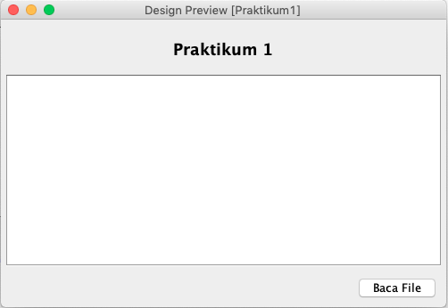
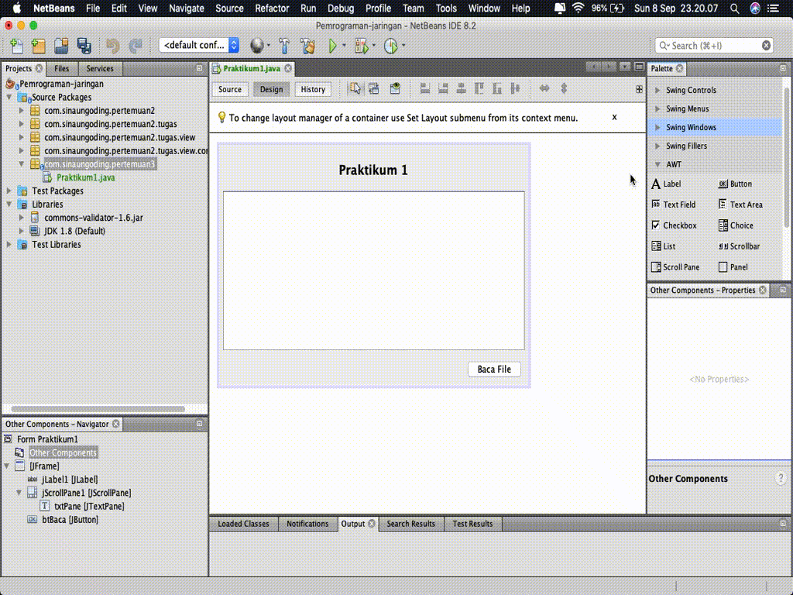
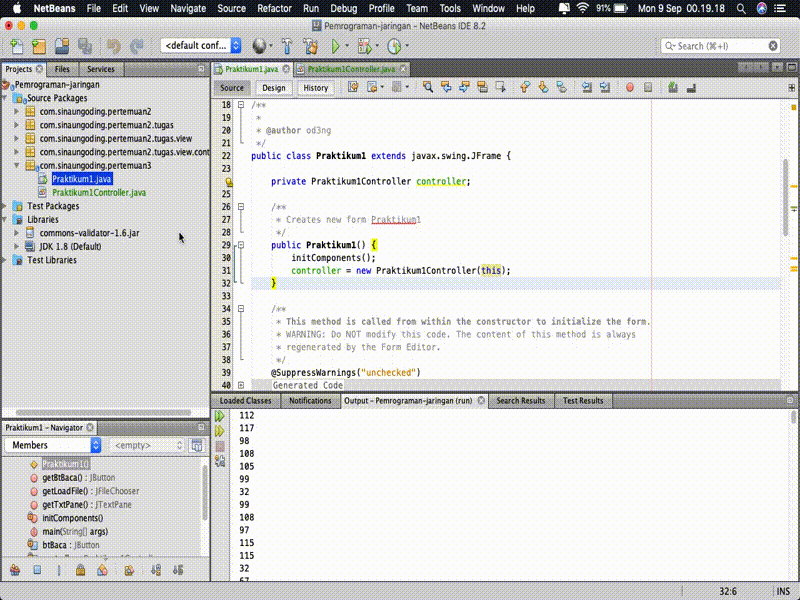
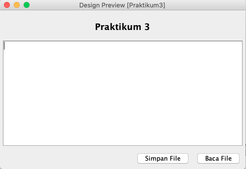
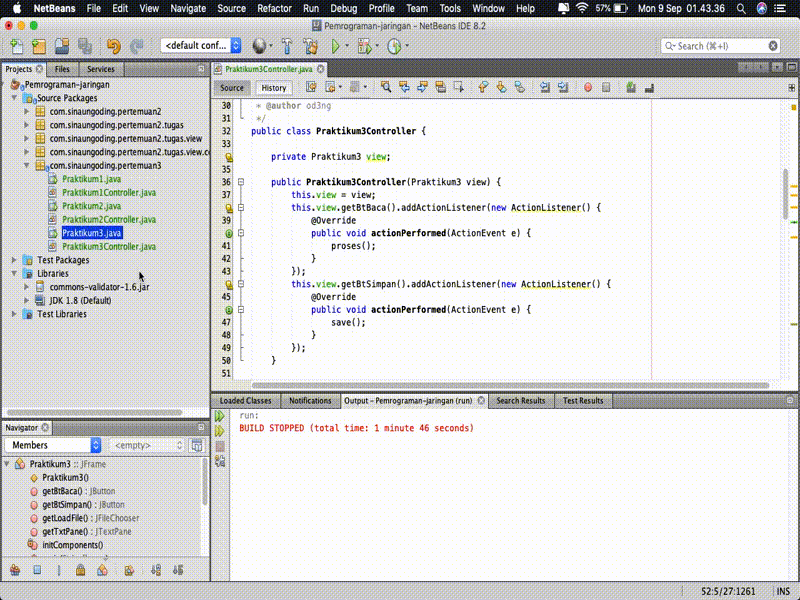

# STREAM

## Tujuan

-   Memahami konsep stream.
-   Menerapkan class `Stream` di bahasa pemrograman Java.

## Petunjuk

-   Awali setiap sebelum membuat projek dengan berdoa.
-	Baca dan pahami tujuan, dasar teori, dan latihan-latihan modul dengan baik.
-	Kerjakan tugas-tugas projek dengan baik, sabar dan jujur

## Ulasan Teori

### Stream

Komunikasi pada level byte, direpresentasikan oleh JAVA menggunakan stream, sebagai wadah tempat informasi dikirim ataupun tempat informasi diterima. Stream dapat dianalogikan dengan pipa air, yang apabila terpasan dengan baik, air (dalam hal ini informasi atau data) dapat mengalir dari suatu tempat ke tempat lain.

   <figure style="text-align: center">
        
        <figcaption style="text-align: center; font-weight: bold">Ilustrasi sebuah stream</figcaption>
   </figure>
    
Dalam membangun sebuah aplikasi, kita harus dapat memilih jenis class stream yang tepat untuk aplikasi kita. Stream dapat digabungkan bersama-sama untuk mendapatkan kemudahan pengolahan informasi.

   <figure style="text-align: center">
        
        <figcaption style="text-align: center; font-weight: bold">Ilustrasi sebuah stream karakter 'a'</figcaption>
   </figure>
    
Ada 2 macam kategori besar Stream:
1. input stream : dimana informasi dapat kita baca / ambil
2. output stream : dimana informasi dapat kita tulis / kirim

Stream digunakan untuk menangani proses I/O di Java. Input stream digunakan untuk membaca data dan output stream untuk menulis data. Kelas stream yang berbeda, seperti `java.io.FileInputStream` dan `sun.net.TelnetOutputStream`, digunakan untuk membaca dan menulis sumber data tertentu. Namun, semua output stream memiliki metode dasar yang sama untuk menulis data dan input stream menggunakan metode dasar yang sama untuk membaca data.

Subclass dari `OutputStream` menggunakan metode untuk menulis data pada media tertentu. Misalnya, `FileOutputStream` menggunakan metode ini untuk menulis data ke dalam file. Metode dasar `OutputStream` adalah `write(int b)`. Metode ini mengambil sebuah integer dari 0 sampai 255 sebagai sebuah argumen dan menulis `byte` sesuai dengan output stream.

Subclass dari `InputStream` menggunakan metode ini untuk membaca data dari media tertentu. Misalnya, `FileInputStream` membaca data dari file. Sebuah `TelnetInputStream` membaca data dari koneksi jaringan. Sebuah `byteArrayInputStream` membaca data dari sebuah array byte.

Metode dasar `InputStream` adalah membaca noargs() method. Metode ini membaca satu `byte` data dari sumber input stream dan mengembalikannya sebagai int dari 0 sampai 255.

### Input Stream

Paket Input Stream terletak pada `java.io.InputStream`. Merupakan stream dimana kita bisa membaca aliran informasi dari suatu sumber.

   <figure style="text-align: center">
        
        <figcaption style="text-align: center; font-weight: bold">Gambar struktur input stream</figcaption>
   </figure>
    
Ada 6 macam input stream yang bisa kita gunakan dari paket tersebut. Saat input stream dibuat, objeknya akan membaca informasi dari sumber informasi.

Kelas abstrak InputStream memiliki method-method umum yang diwariskan pada semua class turunannya, yang mana bersifat public. Method- method tersebut adalah:

1. `int available() throws java.io.IOException:` untuk mengetahui jumlah byte data yang saat ini tersedia untuk dibaca.
2. `void close() throws java.io.IOException:` menutup input stream dan melepaskan sumber daya yang terkait dengan input stream tersebut (contoh : file yang menjadi sumber input stream)
3. `void mark(int readLimit):` mencatat posisi input stram saat ini, agar nanti bisa kembali ke titik yang dicatat dengan memanggil method InputStream.reset() . Tidak semua input stream mendukung method ini.
4. `boolean markSupported():` mengembalikan nilai “true” apabila input stream mendukung mark() dan reset().
5. `int read() throws java.io.IOException:` mengambil byte data berikutnya dari stream. Subkelas dari InputStream biasanya menuliskan ulang method ini untuk menyesuaikan fungsinya (seperti untuk membaca dari string seperti pada `StringBufferInputStream`, atau untuk membaca dari file seperti pada FileInputStream). Input stream akan mengeblok penggunaan I/O, dan akan memblok seterusnya hingga ada byte data berikutnya untuk dibaca. Apabila akhir dari stream tercapai, nilai -1 akan dimunculkan.
6. `int read(byte[] byteArray) throws java.io.IOException:` membaca serangkaian byte dan menempatkannya pada array byte yang ditunjuk dalam paramete input, dengan berulang-ulang memanggil methode read() hingga array byte tersebut penuh terisi atau tidak ada lagi data yang tersedia untuk di baca. Method ini akan mengembalikan nilai integer jumlah byte data yang dibaca secara sukses, atau -1 apabila akhir stream telah tercapai.
7. `int read(byte [] byteArray, int offset, int length) throws java.io.IOException, java.lang.IndexOutOfBoundsException`
8. `void reset() throws java.io.IOException:` mengembalikan posisi stream ke posisi yang telah ditandai oleh method mark().
9. `long skip(long amount) throws java.io.IOException:` membaca data byte, tapi diabaikan selama sejumlah nilai yang diinputkan dalam parameter (long amount). Data yang dibaca tidak disimpan, tetapi proses pembacaan terus mengalir maju.

### Output Stream

Paket OutputSteam terletak pada `java.io.OutputStream`. Output stream merupakan stream dimana kita bisa menuliskan infomasi untuk dikirim ke sesuatu penerima informasi.

   <figure style="text-align: center">
        
        <figcaption style="text-align: center; font-weight: bold">Gambar struktur output stream</figcaption>
   </figure>
    
Turunan output stream yang bisa langsung kita gunakan ada 6 kelas, yang memiliki fungsi masing-masing, seperti menuliskan string , menuliskan data ke file atau ke pipa komunikasi. Output stream merupakan produsen informasi, dia membuat byte dari informasi dan mengirimkannya ke tempat lain. Data dikomunikasikan secara sekuensial, data byte yang pertama masuk stream akan pertama kali keluar pula.

Tabel komponen dalam Outputstream

| Low-Level Output Stream   | Fungsi                                    |
| ---                       | ---                                       |
| `ByteArrayOutputStream`     | Menuliskan data byte ke sebuah array byte |
| `FileOutputStream`          | Menuliskan data byte ke sebuah file lokal |
| `PipedOutputStream`         | Menuliskan data byte ke pipa komunikasi |
| `StringBufferOutputStream`  | Menuliskan byte ke sebuah string buffer |
| `System.err`                | Menuliskan data byte ke stream error pada konsol pengguna |
| `System.out`                | Menuliskan data byte ke konsol pengguna |

Method-method yang dimiliki oleh output stream antara lain adalah:

1. `void close():` menutup output stream, dan memberitahu ujung stream satunya (penerima) bahwa stream telah berakhir.
2. `void flush():` melakukan “flushing” data yang belum terkirim ke sisi penerima dari output stream. Untuk meningkatkan performasi aplikasi, sering kali stream diberi buffer, sehingga data-data disimpan terlebih dahulu sebelum dikirim. Method ini cukup penting bagi subkelas output stream yang digunakan pada operasi jaringan, dimana ‘flushing’ data selalu terjadi setelah terjadi operasi request atau response dikirimkan sehingga host lawan komunikasi tidak menunggu-nunggu data.
3. `void write (int byte):` menuliskan byte yang diinputkan pada parameter method ini. Merupakan method abstrak yang dioverride oleh subklas-subklas turunan output stream.
4. `void write (byte[] byteArray):` menuliskan isi dari array byte yang menjadi parameter method ini.
5. `void write (byte[] byteArray, int offset, int length).`

### Reader dan Writer

Subkelas yang paling penting dari `Reader` dan `Writer` adalah `InputStreamReader` dan kelas `OutputStreamWriter`. Sebuah `InputStreamReader` berisi input stream dasar dari yang membaca byte mentah. Ini menerjemahkan byte ini menjadi karakter Unicode sesuai dengan pengkodean tertentu. Sebuah `OutputStreamWriter` menerima karakter Unicode dari program yang berjalan.
Kemudian menerjemahkan karakter tersebut ke dalam byte menggunakan pengkodean tertentu dan menulis byte ke output stream yang mendasarinya. Selain dua kelas tersebut, paket java.io menyediakan beberapa pembaca baku dan kelas penulis yang membaca karakter tanpa langsung membutuhkan arus input yang mendasarinya, antara lain adalah:

- `FileReader`
- `FileWriter`
- `StringReader`
- `StringWriter`
- `CharArrayReader`
- `CharArrayWriter`

## Praktikum 1

Pada praktikum 1 akan mencoba membaca isi dari sebuah file menggunakan class `FileInputStream`, file yang dibaca adalah file plain text.

Ikutilah langkah-langkah sebagai berikut
1. Buatlah tampilan seperti ditunjukkan pada gambar di bawah ini, misalkan nama class `Praktikum1`
    <figure style="text-align: center">
            
            <figcaption style="text-align: center; font-weight: bold">Gambar tampilan praktikum 1</figcaption>
    </figure>
2. Tambahkan komponen File Chooser pada tampilan tersebut, file chooser digunakan untuk menampilkan dialog pemilihan file atau folder. `Klik kanan Other Components - Add From Palette - Swing Windows - File Chooser.` Untuk lebih jelasnya ditunjukkan pada gambar di bawah ini
    <figure style="text-align: center">
            
            <figcaption style="text-align: center; font-weight: bold">Menambahkan File Chooser</figcaption>
    </figure>
    
    Atau bisa juga dengan menggunakan drag and drop seperti ditunjukkan pada gambar di bawah ini
    <figure style="text-align: center">
                
                <figcaption style="text-align: center; font-weight: bold">Menambahkan File Chooser</figcaption>
    </figure>
    
    Pada tampilan di atas terdapat 3 komponen utama yaitu:
    
    - `JFileChooser`: Untuk mengambil file atau folder di lokal
    - `JButton`: Untuk memanggil `JFileChooser`
    - `JTextPane`: Untuk menampilkan isi file yang telah dibaca
    
3. Tambah kode seperti di bawah ini pada JFrame yang telah Anda buat sebelumnya menggunakan langkah berikut ini
    
   - Pindah ke tab Source - Letakkan kursor pada baris kosong - Klik Kanan - Pilih Insert Code - Getter ... - Pilih component yang akan digunakan pada class lain - Klik Generate. Untuk lebih jelaskan ditunjukkan pada gambar di bawah ini
   
   <figure style="text-align: center">
                   
                   <figcaption style="text-align: center; font-weight: bold">Menambahkan kode getter component</figcaption>
   </figure>
   
   Sehingga kode yang terbentuk adalah sebagai berikut
    
   ```java
       public JButton getBtBaca() {
           return btBaca;
       }
   
       public JFileChooser getLoadFile() {
           return loadFile;
       }
   
       public JTextPane getTxtPane() {
           return txtPane;
       } 
   ```
4. Buat sebuah class untuk menghandle view yang telah kita buat, misalkan class `Praktikum1Controller`
5. Tambahkan variabel class `Praktikum1` dan konstruktor seperti di bawah ini
    ```java
    private Praktikum1 view;
    
        public Praktikum1Controller(Praktikum1 view) {
            this.view = view;
        }
    ```
6. Kemudian buat fungsi untuk membaca sebuah file, potongan kodenya seperti di bawah ini
    ```java
    private void proses() {
            JFileChooser loadFile = view.getLoadFile();
            StyledDocument doc = view.getTxtPane().getStyledDocument();
            if (JFileChooser.APPROVE_OPTION == loadFile.showOpenDialog(view)) {
                InputStream inputStream = null;
                try {
                    inputStream = new FileInputStream(loadFile.getSelectedFile());
                    int read = inputStream.read();
                    doc.insertString(0, "", null);
                    while (read != -1) {
                        doc.insertString(doc.getLength(), "" + read, null);
                        System.out.println("" + read);
                        read = inputStream.read();
                    }
                } catch (FileNotFoundException ex) {
                    Logger.getLogger(Praktikum1Controller.class.getName()).log(Level.SEVERE, null, ex);
                } catch (IOException | BadLocationException ex) {
                    Logger.getLogger(Praktikum1Controller.class.getName()).log(Level.SEVERE, null, ex);
                } finally {
                    if (inputStream != null) {
                        try {
                            inputStream.close();
                        } catch (IOException ex) {
                            Logger.getLogger(Praktikum1Controller.class.getName()).log(Level.SEVERE, null, ex);
                        }
                    }
                }
            }
        }
    ```
7. Tambahkan listener pada button agar ketika tombol diklik dapat melakukan aksi, kode tersebut berada di dalam konstruktor
    ```java
    this.view.getBtBaca().addActionListener(new ActionListener() {
                @Override
                public void actionPerformed(ActionEvent e) {
                    proses();
                }
            });
    ```
8. Yang terakhir adalah menambahkan variabel controller dalam view, class `Praktikum1`

    ```java
    private Praktikum1Controller controller;
    
        public Praktikum1() {
            initComponents();
            controller = new Praktikum1Controller(this);
        }
    ```
9. Jalankan program yang telah Anda buat, kemudian amati hasilnya

    <figure style="text-align: center">
                   
                   <figcaption style="text-align: center; font-weight: bold">Hasil praktikum 1</figcaption>
   </figure>

### Pertanyaan
1. Mengapa menggunakan sintak `while (read != -1)` untuk melakukan pembacaan?
2. Seberapa penting perintah `inputStream.close();` dipanggil setelah selesai membaca file?
3. Mengapa isi file yang dibaca dengan yang ditampilkan berbeda?  

## Praktikum 2

Pada praktikum 2 ini adalah melakukan copy isi file, hal tersebut dilakukan dengan membaca per-byte selanjutnya dilakukan penulisan.

Ikutilah langkah-langkah sebagai berikut
1. Masih menggunakan form yang sama atau buat baru dengan mempertahankan fungsi yang sebelumnya, tambah tombol lagi untuk menyimpan sebuah file. Tampilan setelah ditambahkan adalah sebagai berikut
    <figure style="text-align: center">
                       
                       <figcaption style="text-align: center; font-weight: bold">Tampilan Praktikum 2</figcaption>
    </figure>
2. Silakan menggunakan langkah seperti pada praktikum 1, misalkan untuk menambahkan `getter component`. Tambahkan kode di bawah ini pada form yang telah Anda buat.
    ```java
    public JButton getBtSimpan() {
            return btSimpan;
        }
    ```
3. Buat fungsi untuk melakukan penyimpanan ketika sebuah tombol ditekan, potongan kodenya adalah sebagai berikut
    ```java
    private void save() {
            JFileChooser loadFile = view.getLoadFile();
            if (JFileChooser.APPROVE_OPTION == loadFile.showSaveDialog(view)) {
                OutputStream os = null;
                try {
                    if (!list.isEmpty()) {
                        os = new FileOutputStream(loadFile.getSelectedFile());
                        byte[] dt = new byte[list.size()];
                        for (int i = 0; i < list.size(); i++) {
                            dt[i] = list.get(i).byteValue();
                        }
                        os.write(dt);
                    }
                } catch (FileNotFoundException ex) {
                    Logger.getLogger(Praktikum2Controller.class.getName()).log(Level.SEVERE, null, ex);
                } catch (IOException ex) {
                    Logger.getLogger(Praktikum2Controller.class.getName()).log(Level.SEVERE, null, ex);
                } finally {
                    if (os != null) {
                        try {
                            os.flush();
                            os.close();
                            list.clear();
                        } catch (IOException ex) {
                            Logger.getLogger(Praktikum2Controller.class.getName()).log(Level.SEVERE, null, ex);
                        }
                    }
                }
            }
        }
    ```
4. Tambahkan juga variabel global untuk menyimpan hasil pembacaan
    ```java
    private List<Integer> list = new ArrayList<>();
    ``` 
   Pada fungsi pembacaan tambah perintah untuk menambahkan data yang dibaca sebelum dilakukan penyimpanan ke dalam sebuah file, potongan kodenya adalah sebagai berikut
   ```java
    while (read != -1) {
       list.add(read);// tambahkan 1 baris
       doc.insertString(doc.getLength(), "" + read, null);
       System.out.println("" + read);
       read = inputStream.read();
       }
    ```
5. Tambahkan juga listener untuk tombol simpan, isinya adalah memanggil methode simpan
    ```java
    this.view.getBtSimpan().addActionListener(new ActionListener() {
                @Override
                public void actionPerformed(ActionEvent e) {
                    save();
                }
            });
    ```
6. Jalankan program yang Anda buat, amati hasilnya
    <figure style="text-align: center">
        
        <figcaption style="text-align: center; font-weight: bold">Hasil praktikum 2</figcaption>
    </figure>
       
### Pertanyaan
1. Mengapa `OutputStream os = null;` di-instance bukan menggunakan `new OutputStream`, tetapi `os = new FileOutputStream(loadFile.getSelectedFile());`?
2. Hilangkan `os.flush();` dan `os.close();`, apa yang terjadi? Mengapa demikian?

## Praktikum 3

Pada praktikum 3 akan membuat program sederhana untuk menulis dan membaca sebuah text yang diinput ke dalam sebuah textpane, setelah proses input selesai akan disimpan ke dalam sebuah file kemudian akan dipanggil kembali file hasil simpan.

1. Masih menggunakan form yang sama atau buat baru dengan mempertahankan fungsi yang sebelumnya, perbedaannya adalah implementasi tombol baca dan tombol simpan.
    <figure style="text-align: center">
                       
                       <figcaption style="text-align: center; font-weight: bold">Tampilan Praktikum 3</figcaption>
    </figure>
    
2. Sesuaikan kode untuk melakukan prose simpan file, sehingga menjadi sebagai berikut
    ```java
    private void save() {
            JFileChooser loadFile = view.getLoadFile();
            if (JFileChooser.APPROVE_OPTION == loadFile.showSaveDialog(view)) {
                BufferedWriter writer = null;
                try {
                    String contents = view.getTxtPane().getText();
                    if (contents != null && !contents.isEmpty()) {
                        writer = new BufferedWriter(new FileWriter(loadFile.getSelectedFile()));
                        writer.write(contents);
                    }
    
                } catch (FileNotFoundException ex) {
                    Logger.getLogger(Praktikum3Controller.class.getName()).log(Level.SEVERE, null, ex);
                } catch (IOException ex) {
                    Logger.getLogger(Praktikum3Controller.class.getName()).log(Level.SEVERE, null, ex);
                } finally {
                    if (writer != null) {
                        try {
                            writer.flush();
                            writer.close();
                            view.getTxtPane().setText("");
                        } catch (IOException ex) {
                            Logger.getLogger(Praktikum3Controller.class.getName()).log(Level.SEVERE, null, ex);
                        }
                    }
                }
            }
        }
    ```
3. Sesuaikan juga fungsi untuk melakukan proses pembacaan file, sehingga menjadi seperti berikut ini
    ```java
    private void proses() {
            JFileChooser loadFile = view.getLoadFile();
            StyledDocument doc = view.getTxtPane().getStyledDocument();
            if (JFileChooser.APPROVE_OPTION == loadFile.showOpenDialog(view)) {
                BufferedReader reader = null;
                try {
                    reader = new BufferedReader(new FileReader(loadFile.getSelectedFile()));
                    String data = null;
                    doc.insertString(0, "", null);
                    while ((data = reader.readLine()) != null) {
                        doc.insertString(doc.getLength(), data, null);
                    }
                } catch (FileNotFoundException ex) {
                    Logger.getLogger(Praktikum3Controller.class.getName()).log(Level.SEVERE, null, ex);
                } catch (IOException | BadLocationException ex) {
                    Logger.getLogger(Praktikum3Controller.class.getName()).log(Level.SEVERE, null, ex);
                } finally {
                    if (reader != null) {
                        try {
                            reader.close();
                        } catch (IOException ex) {
                            Logger.getLogger(Praktikum3Controller.class.getName()).log(Level.SEVERE, null, ex);
                        }
                    }
                }
            }
        }
    ```
4. Jalankan program yang telah Anda buat, jika semua normal seharusnya adalah seperti di bawah ini
    <figure style="text-align: center">
                           
                           <figcaption style="text-align: center; font-weight: bold">Hasil Praktikum 3</figcaption>
    </figure>

### Pertanyaan
1. Silakan inputkan beberapa baris kalimat, selanjutnya simpan dan dibaca kembali? apa yang terjadi?
2. Jika yang disimpan dengan yang dibaca tidak sesuai, silakan disesuaikan!

## Tugas