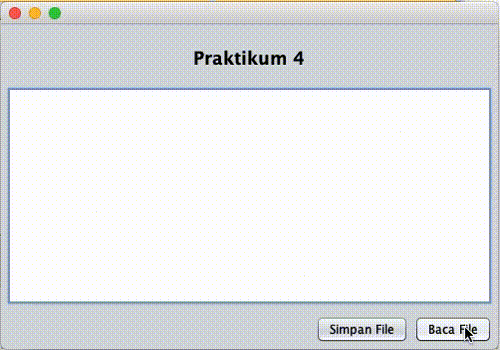

# FILTER STREAM

## Tujuan

-   Memahami fungsi dan mengetahui kelebihan dari filter stream
-   Menerapkannya dalam aplikasi

## Petunjuk

-   Awali setiap sebelum membuat projek dengan berdoa.
-	Baca dan pahami tujuan, dasar teori, dan latihan-latihan modul dengan baik.
-	Kerjakan tugas-tugas projek dengan baik, sabar dan jujur

## Ulasan Teori

Karena stream dasar hanya menerapkan mekanisme pembacaan byte dari informasi atau data secara sederhana, maka fleksibilitasnya terbatas. Pembacaan byte dari data tidaklah simpel, arti dari byte bisa bervariasi tergantung jenis datanya. Teks contohnya, merupakan rangkaian dari karakter karakter, dan contoh lain adalah deretan angka-angka yang mana masing-masing karakter dan angka bisa dibentuk lebih dari satu byte data tunggal. Komunikasi pada level byte juga bisa sangat tidak efisien, dan pemberian buffer juga dapat meningkatkan performasi dari sistem. Permasalahan-permasalahan tersebut bisa diatasi dengan penggunaan filter stream.

### Dasar Filter Stream

Filter Stream menambahkan fungsionalitas pada stream-stream dasar, dengan memproses data sedemikian rupa (seperti penambahan buffer untuk meningkatkan kinerja) atau menambahkan method-method untuk mengakses data dalam cara yang berbeda (seperti membaca data per baris, dibandingkan pembacaan data standar yang byte per byte).

Filter Stream dibagi pula menjadi 2 kategori :  filter input stream dan filter output stream. Setiap filter stream disambungkan ke input stream atau output stream dalam penggunaannya. Menyambungkan filter stream sangat sederhana, buat objek filter streamnya (dengan memasukkan stream yang sudah ada  ke parameter input method pembentuknya), dan selanjutnya proses pembacaan atau penulisan data cukup melalui filter stream tersebut.

Contoh apabila kita ingin menggunakan salah satu filter output stream yang bertipe PrintStream (digunakan untuk mencetak teks ke subclass dari Output Stream) pada stream output yang menuliskan data ke file. Kode di bawah ini dapat digunakan :

```java
FileOutputStream fout = new FileOutputStream ( somefile ); 
PrintStream pout = new PrintStream (fout); 
pout.println ("hello world");
```

Dapat dilihat bahwa penulisan atau pembacaan yang tadinya dilakukan pada stream dasar, apabila telah dihubungkan dengan sebuah filter stream, maka penulisan atau pembacaan data dilakukan pada filter streamnya. 

### Filter Input Stream

Beberapa filter input stream yang umum dan terdapat pada semua versi Java dalah sebagai berikut:

Tabel Filter Input Stream

| Filter Input Stream       | Fungsi                                                                    |
| ---                       | ---                                                                       |
| `BufferedInputStream`     | Memberi buffer pengaksesan data, untuk meningkatkan efisiensi dan kinerja |
| `DataInputStream`         | Membaca tipe data primitif (int, float, double etc)                       |
| `LineNumberInputStream`   | Menjaga hitungan jumlah baris dari data yang sedang dibaca berdasarkan karakter-karakter yang memiliki interpretasi end-of-line |
| `PushBackInputStream`     | Filter yang memungkinkan pembacaan data dan mengembalikannya lagi ke dalam stream untuk dibaca lagi. |


### Buffered Input Stream

Kegunaan dari memberikan buffer pada I/O adalah menambah performasi kerja. Dibandingkan dengan pembacaan data byte per byte, sejumlah besar byte dibaca bersamaan pada saat method read()class ini dieksekusi. Hal ini meningkatkan kecepatan waktu akses dari sumber data dan mengurangi jumlah blok aplikasi ke input yang menjadi sumber data.

- Konstruktor buffered input stream
    - `BufferedInputStream(InputStream input)`: membuat stream dengan buffer yang akan membaca dari input stream yang dijadikan parameter
    - `BufferedInputStream(InputStream input, int bufferSize)`: membuat stream dengan buffer sesuai ukuran yang ditentukan, yang akan membaca dari input stream yang dijadikan parameter.
- Method-method
    Tidak ada method tambahan. Hanya memodifikasi method read(), dan mendukung pemakaian method mark() dan reset().
    
### Data Input Stream

Penulisan dan pembacaan data bertipe primitif seperti angka dan karakter sangat sering dijumpai dalam pemrograman. Informasi / data seperti itu tidak mudah direpresentasikan dalam byte-byte. Dengan filter stream ini, pengembang aplikasi tidak perlu susah-susah dalam mengkonversi data byte ke data primitif. Tetapi cukup dengan memanfaatkan method dari kelas filter stream ini, yang otomatis melakukan mentranlasi data.

- Konstruktor
    - `DataInputStream(InputStream input)`
- Method-method
    -   `boolean readBoolean()`
    -	`char readChar()` 
    -	`double readDouble()`
    -	`float readFloat()` 
    -	`void readFully(byte[] byteArray)` 
    -	`void readFully(byte[] byteArray, int offset, int length)` 
    -	`float readInt()` 
    -	`String readLine()`
    -	`long readLong()`
    -	`short readShort( )`
    -	`int readUnsignedByte( )` 
    -	`int readUnsignedShort( )` 
    -	`String readUTF( )`
    -	`static String readUTF(DataInputStream input)`
    -	`int skipBytes(int number).`

### LineNumber Input Stream

Memberikan fungsionalitas yang berguna yaitu memantau jumlah baris data yang telah dibaca dari input stream.

**Konstruktor**
-   `LineNumberInputStream(InputStream input)` – membuat sebuah line number stream, yang membaca dari input stream input

**Methods**
-   `int getLineNumber()` – mengembalikan nilai jumlah baris yang telah dibaca dari input stream yang bersangkutan
-	`void setLineNumber(int number)` – mengubah nilai counter nomor baris menjadi nilai yang ditentukan dalam number

### Push Back Input Stream

Memiliki kemampuan untuk membaca sebuah byte data tunggal, lalu dikembalikan lagi ke dalam input stream untuk dibaca kemudian. Untuk itu dia mempunyai sebuah buffer internal. Kelas ini berguna bila programmer ingin ‘mengintip’ data apa yang akan dibaca selanjutnya dari rangkaian byte data pada input stream.

**Konstruktor**

   - `PushBackInputStream(InputStream input)`
   - `PushBackInputStream(InputStream input, int bufferSize)` – membuat  PushBackInputStream yang akan membaca dari input stream dan menggunakan buffer dengan besar yang ditentukan.

**Methods**

   - `void unread(byte[] byteArray)` – mengembalikan isi dari array byteArray.
   - `void unread(byte[] byteArray, int offset, int length)`
   - `void unread(int byte)` – mengembalikan byte yang diinputkan ke awal dari buffer

### Filter Output Stream

Beberapa filter output stream yang umum dan terdapat pada semua versi Java adalah sebagai berikut :

Tabel Kegunaan Output Stream

| Filter Output Stream          | Kegunaan                                                                                          |
| ---                           | ---                                                                                               |
| `BufferedOutputStream`        | Menyediakan buffer untuk menuliskan data                                                          |
| `DataOutputStream`            | Menuliskan tipe data primitif seperti  bytes dan angka.                                           |
| `PrintStream`                 | Menyediakan method tambahan untuk menuliskan baris teks atau tipe data lain sebagai sebuah teks   |

### Buffered Output Stream

Memiliki buffer internal yang dikelolanya, dimana apabila buffer tersebut penuh, maka isi dari buffer akan dikosongkan untuk dimasukkan ke output stream dimana dia terhubung.

-   **Konstruktor**

    - `BufferedOutputStream(OutputStream output)` – membuat buffer untuk menuliskan data pada output stream yang ditunjuk (default buffer nya sebesar 512 bytes)    
    - `BufferedOutputStream(OutputStream output, int bufferSize)` – membuat objek bufferedOutputStream yang terhubung pada output stream yang ditunjuk dengan ukuran buffer  yang ditentukan.
-  **Methods**

    Tidak memiliki method tambahan selain bawaan dari kelas Output Stream.

### Data Output Stream

Didesain untuk bekerja dengan tipe data primitif seperti angka-angka atau bytes.

-   **Konstruktor**

    - `DataOutputStream(OutputStream output)` – membuat objek data output stream yang terhubung dengan output stream yang ditunjuk
    
-   **Method**

    -   `int size( )` – mengembalikan jumlah byte yang telah dikirimkan pada data output stream
    -   `void writeBoolean(boolean value)` – menuliskan nilai boolean yang ditentukan dalam bentuk byte
    -   `void writeByte(int byte)` – menuliskan byte yang ditentukan pada output stream
    -   `void writeBytes(String string)` – menuliskan seluruh isi string ke output stream sebagai byte, satu per satu byte
    -   `void writeChar(int char)` – menuliskan karakter ke output stream sebagai nilai byte (2 byte per karakter)
    -   `void writeChars(String string)` – menuliskan seluruh isi string ke output stream sebagai byte, masing-masing karakter diwakili 2 byte
    -   `void writeDouble(double doubleValue)` – mengkonversi nilai data double yang dimasukkan menjadi nilai long, lalu mengkonversinya lagi ke dalam bentuk 8-byte data.
    -	`void writeFloat(float floatValue)` – mengkonversi nilai data float yang dimasukkan menjadi nilai int, lalu mengkonversinya lagi ke dalam bentuk 4-byte data.
    -	`void writeInt(int intValue)` – menuliskan nilai int sebagai 4-byte data
    -	`void writeLong(int intValue)` – menuliskan nilai long sebagai 8-byte data
    -	`void writeShort(int intValue)` – menuliskan nilai short sebagai 2-byte data
    -	`void writeUTF(String string)` – menuliskan isi string menggunakan UTF-8 encoding

### PrintStream

-   **Konstuktor** :

    -   `PrintStream (OutputStream output)`      
    -	`PrintStream (OutputStream output, boolean flush)` – membuat print stream dimana bila nilai boolean diset ‘true’, maka buffer yang dimilikinya bisa otomatis melakukan ‘flushing’ data
    
-   **Method**

    -	`boolean checkError( )` – automatically flushed the output stream and checks to see if an error has occurred
    -	`void print(boolean value)` – print a boolean value
    -	`void print(char character)` – prints a character value
    -	`void print(char [] charArray)` – prints an array of characters
    -	`void print(double doubleValue)` – prints a double value
    -	`void print(float floatValue)` – prints a float value
    -	`void print(int intValue)` – prints an int value
    -	`void print(long longValue)` – prints a long value
    -	`void print(Object obj)` – prints the value of the specified object’s toString( ) method
    -	`void print(String string)` – prints a string’s contents
    -	`void println( )` – sends a line separator (\n)
    -	`void println(char character)` – prints a character value followed by a println()
    -	`void println(char[] charArray)` – prints an array of characters followed by println()
    -	`void println(double doubleValue)` – prints a double value followed by println() Methods
    -	`void println(float floatValue)` – prints a float value followed by println()
    -	`void println(int intValue)` – prints an int value followed by println()
    -	`void println(long longValue)` – prints a long value followed by println()
    -	`void println(Object obj)` – prints the value of the specified object’s toString( ) method followed by println()
    -	`void println(String string)` – prints a string followed by a line separator
    -	`protected void SetError( )` – modifies the error flag to a value of “true”

## Praktikum 1

Pada praktikum 1 yaitu program yang dibuat agar dapat membaca input karakter dari keyboard, dengan memanfaatkan class `BufferedReader`.

1. Buat class `ReadInputKeyboard`
2. Tambahkan kode di bawah ini pada `method main()` 

    ```java
    BufferedReader br = new BufferedReader(new InputStreamReader(System.in));
            System.out.println("Masukan karakter apapun, [tekan keluar tekan `q`]: ");
            char input = 0;
            do {
                try {
                    input = (char) br.read();
                    System.out.print("" + input);
                } catch (IOException ex) {
                    Logger.getLogger(ReadInputKeyboard.class.getName()).log(Level.SEVERE, null, ex);
                }
            } while (input != 'q');
    ```

3. Silakan jalankan kode di atas, dan amati hasil

### Pertanyaan

1. Modifikasi program di atas sehingga dapat melakukan pembacaan text atau `String`!
2. Mengapa `try-catch` diletakkan di dalam perulangan `do-while`?
3. Silakan ubah kode di atas dengan memanfaatkan class selain `BufferedReader`, tetapi masih bisa membaca input melalui keyboard!

## Praktikum 2

Pada praktikum 2 ini kita akan memanfaatkan class `BufferedInputStream` dan class `BufferedOutputStream` untuk melakukan operasi pada sebuah file. Hasilnya adalah dicontoh pada gambar di bawah ini

   <figure style="text-align: center">
        
        <figcaption style="text-align: center; font-weight: bold">Hasil Praktikum 4</figcaption>
    </figure>

1. Silakan gunakan project pada praktikum 3, penamaan **identifier(class ataupun variabel) harus sesuai dengan convension name Java**.
2. Ubah kode pada fungsi baca atau read menjadi seperti di bawah ini

    ```java
        JFileChooser loadFile = view.getLoadFile();
                StyledDocument doc = view.getTxtPane().getStyledDocument();
                if (JFileChooser.APPROVE_OPTION == loadFile.showOpenDialog(view)) {
                    BufferedInputStream reader = null;
                    try {
                        reader = new BufferedInputStream(new FileInputStream(loadFile.getSelectedFile()));
                        doc.insertString(0, "", null);
                        int temp = 0;
                        List<Integer> list = new ArrayList<>();
                        while ((temp=reader.read()) != -1) {                    
                            list.add(temp);
                        }
                        if (!list.isEmpty()) {
                            byte[] dt = new byte[list.size()];
                            int i = 0;
                            for (Integer integer : list) {
                                dt[i]=integer.byteValue();
                                i++;
                            }
                            doc.insertString(doc.getLength(), new String(dt), null);
                            JOptionPane.showMessageDialog(view, "File berhasil dibaca.", "Informasi", JOptionPane.INFORMATION_MESSAGE);
                        }
                    } catch (FileNotFoundException ex) {
                        Logger.getLogger(Praktikum4Controller.class.getName()).log(Level.SEVERE, null, ex);
                    } catch (IOException | BadLocationException ex) {
                        Logger.getLogger(Praktikum4Controller.class.getName()).log(Level.SEVERE, null, ex);
                    } finally {
                        if (reader != null) {
                            try {
                                reader.close();
                            } catch (IOException ex) {
                                Logger.getLogger(Praktikum4Controller.class.getName()).log(Level.SEVERE, null, ex);
                            }
                        }
                    }
                }
    ```
3. Selanjutnya ubah juga fungsi tulis atau write menjadi seperti di bawah ini
    ```java
    JFileChooser loadFile = view.getLoadFile();
            if (JFileChooser.APPROVE_OPTION == loadFile.showSaveDialog(view)) {
                BufferedOutputStream writer = null;
                try {
                    String contents = view.getTxtPane().getText();
                    if (contents != null && !contents.isEmpty()) {
                        writer = new BufferedOutputStream(new FileOutputStream(loadFile.getSelectedFile()));
                        writer.write(contents.getBytes());
                        JOptionPane.showMessageDialog(view, "File berhasil ditulis.", "Informasi", JOptionPane.INFORMATION_MESSAGE);
                    }
    
                } catch (FileNotFoundException ex) {
                    Logger.getLogger(Praktikum4Controller.class.getName()).log(Level.SEVERE, null, ex);
                } catch (IOException ex) {
                    Logger.getLogger(Praktikum4Controller.class.getName()).log(Level.SEVERE, null, ex);
                } finally {
                    if (writer != null) {
                        try {
                            writer.flush();
                            writer.close();
                            view.getTxtPane().setText("");
                        } catch (IOException ex) {
                            Logger.getLogger(Praktikum4Controller.class.getName()).log(Level.SEVERE, null, ex);
                        }
                    }
                }
            }
    ```
4. Silakan dijalankan, kemudian amati hasilnya.

### Pertanyaan

1. Sebuatkan perbedaan dari yang sebelumnya, ketika kode belum diubah selain dari sisi sintaks! Berikan argument Anda!
2. Pada kode di atas, proses baca menggunakan fungsi `read()`, silakan diubah menggunakan `read(byte b[])` atau `read(byte b[], int off, int len)`. Jalankan kembali hasil perubahan yang Anda lakukan!
3. Pada kode di atas, proses tulis menggunakan fungsi `write(byte b[])`, silakan diubah menggunakan `write(byte b)` atau `write(byte b[], int off, int len)`. Jalankan kembali hasil perubahan yang Anda lakukan!

## Tugas

1. Buat sebuah program dengan tampilan seperti berikut ini

    <figure style="text-align: center">
            
            <figcaption style="text-align: center; font-weight: bold">Tugas</figcaption>
        </figure>

2. Struktur program seperti yang sebelumnya telah diajarkan, bagian logic dan view harus dipisah
3. Terdapat validasi input
    - Ketika field panjang atau lebar kosong menampilkan pesan 
    - Field panjang atau lebar hanya boleh input berupa angka
4. Dengan memanfaatkan class `PrintStream`, buatlah sebuah file logging dari program di atas. 
    - File `log.log` untuk mencatat ketika berhasil melakukan perhitungan
    - File `log.err` untuk mencatat ketika terjadi error.
5. Selamat mengerjakan. :) 