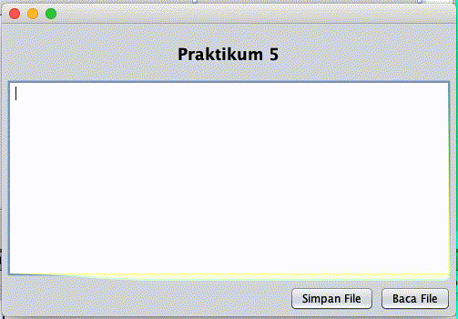

# Class LineNumberInputStream dan Class LineNumberReader

## Tujuan

-   Memahami fungsi dan mengetahui kelebihan dari filter stream dari class `LineNumberInputStream` dan class `LineNumberReader`
-   Menerapkannya dalam aplikasi

## Petunjuk

-   Awali setiap sebelum membuat projek dengan berdoa.
-	Baca dan pahami tujuan, dasar teori, dan latihan-latihan modul dengan baik.
-	Kerjakan tugas-tugas projek dengan baik, sabar dan jujur

## Ulasan Teori

Seperti yang telah disebutkan pada pertemuan sebelumnya, `class LineNumberInputStream` merupakan sebuah class yang digunakan untuk mengetahui baris tertentu pada sebuah stream. _Line_ atau baris ditandai oleh sebuah karakter `\n` atau `\r`, karakter `\n` sering disebut dengan `line feed` dan `\r` disebut dengan `carriage return`.

Contohnya ada sebuah file berisi kalimat sebagai berikut 
>Saya bangga menjadi mahasiswa Politeknik Negeri Malang
>
>Sekarang Politeknik Negeri Malang meraih akreditasi institusi A
>
>Semoga saya dapat memberikan terbaik pada institusi 

Dari kalimat di atas kita dapat mengetahui posisi baris karakter `j` pada kalimat `menjadi`

### Class LineNumberInputStream

Class ini merupakan turunan dari class `Reader`, dengan demikian berarti fungsi utama dari class tersebut adalah untuk membaca sebuah stream. Untuk dapat membaca sebuah stream line number, hal yang pertama dilakukan adalah membaca tipa byte dari sebuah file menggunakan method `read()`. Fungsi `read()` mengembalikan nilai desimal, akan mengembalikan nilai -1 jika telah selesai melakukan pembacaan. Selanjutkan dengan memanggil fungsi `getLineNumber()`, nilai kembalian dari fungsi ini adalah index baris dari sebuah stream.
> Sebenarnya penggunaan class `LineNumberInputStream` sudah tidak disarankan karena class tersebut deprecated, artinya class tersebut kemungkinan akan dihapus dari jdk versi yang terbaru dan biasanya sudah ada pengganti dari class tersebut.   

### Class LineNumberReader

Berbeda dengan class `LineNumberInputStream`, class `LineNumberReader` merupakan turunan dari class `BufferedReader`. Secara konsep sebenarnya sama, digunakan untuk mengetahui informasi baris pada sebuah stream. Perbedaannya adalah ketika menggunakan class ini, pada lokal komputer dibuat sebuah buffer ketika akan membaca sebuah stream. Dengan demikian, jauh lebih efisien dan cepat dari class `LineNumberInputStream`.

- Konstuktor
    - `LineNumberReader(Reader in)`: digunakan untuk membuat objek dengan parameter objek `Reader` dan menggunakan ukuran buffer default.
    - `LineNumberReader(Reader in, int sz)`:  digunakan untuk membuat objek dengan parameter objek `Reader` dan parameter ukuran buffer.
    
        > Ukuran buffer harus disesuaikan dengan stream yang akan dibaca, tidak boleh kurang dari ukuran stream. Sebaiknya harus mengetahui terlebih dahulu ukuran stream yang akan dibaca, jika terlalu besar buffer yang disediakan tentunya aplikasi yang kita buat akan boros memori.                                                                                                                                                
- Method atau fungsi
    
    Secara umum, fungsi-fungsi yang disediakan sama dengan class `LineNumberInputStream` untuk mendapatkan informasi baris, hanya saja karena turunan dari `class BufferedReader` terdapat fungsi-fungsi yang jauh lebih efisien untuk urusan pembacaan stream yaitu
    - `String readLine()`, digunakan untuk membaca stream per baris.
    
        > Ketika menggunakan `readLine()`, tentunya proses pembacaan stream akan jauh lebih efisien karena tidak perlu melakukan pembacaan per-karakter seperti yang dilakukan `class LineNumberInputStream`.    

## Praktikum 1

Pada praktikum 1 yaitu program yang dibuat agar dapat membaca file yang berisi kalimat beberapa baris, dengan memanfaatkan class `LineNumberInputStream`.

1. Buatlah sebuah file dengan nama `coba.txt`, file yang dibuat satu direktori dengan project yang Anda buat.
1. Buat class `ReadFile`
2. Tambahkan kode di bawah ini pada `method main()` 

    ```java
            try {
                int desimal;
                char ascii;
                LineNumberInputStream inputStream = new LineNumberInputStream(new FileInputStream("coba.txt"));
                while ((desimal = inputStream.read()) != -1) {
                    ascii = (char) desimal;
                    System.out.println("" + ascii + " at line " + inputStream.getLineNumber());
                }
            } catch (FileNotFoundException ex) {
                Logger.getLogger(ReadFile.class.getName()).log(Level.SEVERE, null, ex);
            } catch (IOException ex) {
                Logger.getLogger(ReadFile.class.getName()).log(Level.SEVERE, null, ex);
            }
    ```

4. Silakan jalankan kode di atas, dan amati hasil

### Pertanyaan

Modifikasi program di atas sehingga dapat melakukan hal sebagai berikut
- Meminta inputan lokasi file yang Anda buat, lokasi file diinput melalui keyboard.
- Menampilkan jumlah baris pada sebuah file!
- Mencari lokasi baris sebuah karakter tertentu, karakter diinput melalui keyboard 

## Praktikum 2

Pada praktikum 1 yaitu program yang dibuat agar dapat membaca file yang berisi kalimat beberapa baris, dengan memanfaatkan class `LineNumberReader`.

1. Buatlah sebuah class `ReadFileReader`
2. Tulis kode di bawah ini pada method `main()`

    ```java
                try {
                    int desimal;
                    char ascii;
                    LineNumberReader lineNumberReader = new LineNumberReader(new FileReader("coba.txt"));
                    while ((desimal = lineNumberReader.read()) != -1) {
                        ascii = (char) desimal;
                        System.out.println("" + ascii + " at line " + lineNumberReader.getLineNumber());
                    }
                } catch (FileNotFoundException ex) {
                    Logger.getLogger(ReadFileReader.class.getName()).log(Level.SEVERE, null, ex);
                } catch (IOException ex) {
                    Logger.getLogger(ReadFileReader.class.getName()).log(Level.SEVERE, null, ex);
                }
    ```
3. Silakan dijalankan, kemudian amati hasilnya.

### Pertanyaan

Ubah kode di atas sehingga bisa melakukan hal-hal sebagai berikut
- Menginformasikan sebuah kata ada pada baris berapa
- Menghitung jumlah kata 
- Menghitung jumlah karakter

## Tugas

<!--- Buat sebuah program dengan tampilan seperti berikut ini

 <figure style="text-align: center">
            
            <figcaption style="text-align: center; font-weight: bold">Menampilkan jumlah baris, kata, dan karakter</figcaption>
        </figure>

**Selamat mengerjakan. :)** --> 