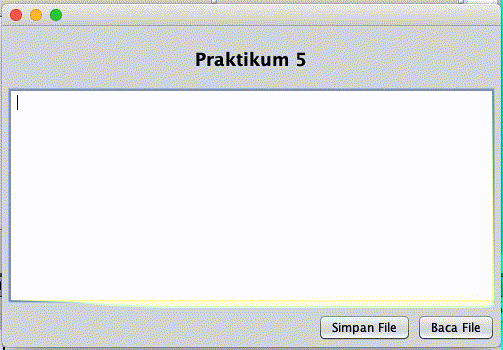

# Class PushbackInputStream dan Class PushbackReader

## Tujuan

-   Memahami fungsi dan mengetahui kelebihan dari filter stream dari class `PushbackInputStream` dan class `PushbackReader`
-   Menerapkannya dalam aplikasi

## Petunjuk

-   Awali setiap sebelum membuat projek dengan berdoa.
-	Baca dan pahami tujuan, dasar teori, dan latihan-latihan modul dengan baik.
-	Kerjakan tugas-tugas projek dengan baik, sabar dan jujur

## Ulasan Teori

### Class `PushbackInputStream`

Class `PushbackInputStream` digunakan untuk memparsing data dari sebuah stream dengan tujuan untuk mengecek data sebelum dilakukan parsing secara menyeluruh. Class `PushbackInputStream` adalah turunan dari class `InputStream` sehingga methode-methode seperti `read(), close()`, dan lainnya.

Konstruktor pada class ini adalah
- `PushbackInputStream(InputStream in)` terdapat parameter `Inpustream` atau stream yang akan dilakukan pembacaan.
- `PushbackInputStream(InputStream in, int size)`, parameter yang dibutuhkan adalah `Inputstream` dan ukuran stream yang akan dilakukan pembacaan.

Sementara untuk methode, selain method yang diwariskan adalah
- `public void unread(int b)`, digunakan untuk push back ke dalam stream data bertipe int. Data yang di-push hanya 1 karakter.
- `public void unread(byte[] b)`, berbeda dengan `unread(int b)`, method ini dapat melakukan push back stream dengan byte array. 
- `public void unread(byte[] b, int off, int len)`, ketika mengetahui ukuran stream yang akan dilakukan push back method ini dapat digunakan. Parameter yang harus dilewatkan adalah data dalam bentuk array, posisi awal stream yang akan dibaca dan panjang dari stream. 

Untuk dapat menggunakan `PushbackInputStream` langkah yang dapat dilakukan adalah
- Instansiasi class `PushbackInputStream`
- Lakukan pembacaan menggunakan methode `read()`, gunakan perulangan karena pembacaan dilakukan per `byte`
- Panggil methode `unread()` untuk mengembalikan data ke stream
- Jangan lupa untuk menutup stream dengan memanggil method `close()`

### Class `PushbackReader`

Secara prinsip class ini sama dengan `PushbackInputStream`, merupakan class untuk menghandle pembacaan sebuah stream. Perbedaannya adalah untuk class ini terdapat mekanisme penyimpanan dalam sebuah buffer, sehingga prosesnya akan lebih cepat. Selain itu, ketika memanggil method `read()` dan `unread()` method yang digunakan bukan `byte[]`, akan tetapi menggunakan `char[]`.

Konstrukor yang dapat digunakan
- `PushbackReader(Reader in)`, parameter yang harus diisi adalah stream yang akan dibaca
- `PushbackReader(Reader in, int size)`, selain parameter stream yang akan dibaca ditambahkan ukuran dari buffer untuk melakukan pembacaan.

Kemudian untuk method yang dapat digunakan
- `void unread(char[] cbuf)`, melakukan push back sebuah array karakter dan mengcopy ke dalam sebuah buffer
- `void unread(char[] cbuf, int off, int len)`, melakukan push back sebuah array karakter dan mengcopy ke dalam sebuah buffer dengan panjang dan posisi awal buffer
- `void unread(int b)`, melakukan push back satu data bertipe integer

Untuk dapat menggunakan `PushbackReader` langkah yang dapat dilakukan adalah
- Instansiasi class `PushbackReader`
- Lakukan pembacaan menggunakan methode `read()`, gunakan perulangan karena pembacaan dilakukan per `char`. Jika tanpa perulangan, gunakan `read()` dengan parameter `byte[]`
- Panggil methode `unread()` untuk mengembalikan data ke stream
- Jangan lupa untuk menutup stream dengan memanggil method `close()`

## Praktikum 1

Pada praktikum 1 yaitu program yang dibuat agar dapat membaca stream yang diinputkan melalui keyboard, dengan memanfaatkan class `PushbackInputStream`.

1. Buat class `ReadStreamPushBackInputStream`
2. Tambahkan kode di bawah ini pada `method main()` 

    ```java
            PushbackInputStream stream = new PushbackInputStream(System.in);
                    System.out.print("Masukan karakter apapun: ");
                    try {
                        int read = stream.read();
                        int read2 = stream.read();
                        System.out.print("" + (char) read);
                        System.out.print("" + (char) read2);
                    } catch (IOException ex) {
                        Logger.getLogger(ReadFilePushBackInputStream.class.getName()).log(Level.SEVERE, null, ex);
                    }
    ``` 
4. Silakan jalankan kode di atas, dan amati hasil
5. Tambahkan sintaks `stream.unread(read);` di bawah `int read = stream.read();`
6. Jalankan kembali, apakah ada perbedaan outputnya dari sebelumnya? Jika ada, mengapa bisa demikian.

### Pertanyaan

- Buat file `coba.txt` di dalam project yang Anda buat
- Baca file `coba.txt` menggunakan class `PushbackInputStream` tanpa menggunakan perulangan
- Silakan explore penggunaan method `unread()`

## Praktikum 2

Pada praktikum 1 yaitu program yang dibuat agar dapat membaca input melalui keyboard, dengan memanfaatkan class `PushbackReader`.

1. Buatlah sebuah class `ReadStreamPushBackReader`
2. Tulis kode di bawah ini pada method `main()`

    ```java
                String s = "Polinema tetap jaya selalu di kancah nasional dan akan berlanjut ke internasional";
                        PushbackReader reader = new PushbackReader(new InputStreamReader(new ByteArrayInputStream(s.getBytes())));
                        char[] words = new char[s.length()];
                        try {
                            reader.read(words);
                            System.out.println("" + new String(words));
                            words = new char[8];
                            reader.unread(words);
                        } catch (IOException ex) {
                            Logger.getLogger(ReadStreamPushBackReader.class.getName()).log(Level.SEVERE, null, ex);
                        }
    ```
3. Silakan dijalankan, kemudian amati hasilnya.

### Pertanyaan

- Silakan tambahkan perintah untuk membaca semua stream setelah sintaks `reader.unread(words);`
- Buatlah file `coba.txt`, kemudian baca file tersebut menggunakan class `PushbackReader`
- Panggil method `unread()` untuk membaca kata tertentu dari file `coba.txt` 

## Tugas

<!---Buat sebuah program dengan tampilan seperti berikut ini

 <figure style="text-align: center">
            
            <figcaption style="text-align: center; font-weight: bold">Menampilkan jumlah baris, kata, dan karakter</figcaption>
        </figure>

**Selamat mengerjakan. :)** --->