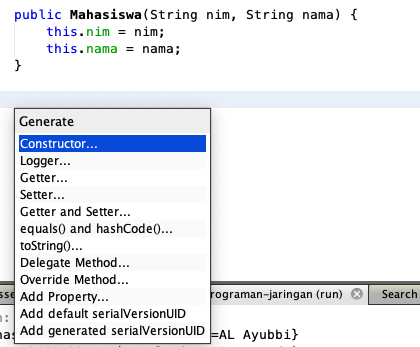
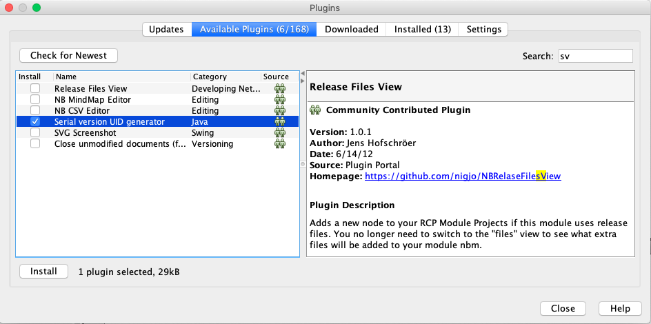
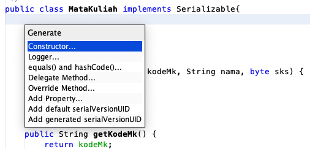
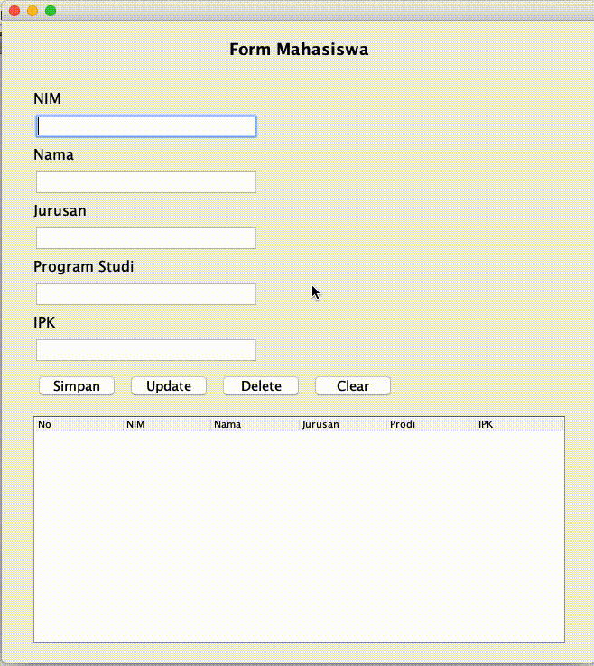

# Object Persistence dan Object Serialization

## Tujuan

- Memahami konsep `object persistence`
-	Menerapkan `object persistence` dengan menggunakan `object serialization` pada aplikasi

## Petunjuk

-   Awali setiap sebelum membuat projek dengan berdoa.
-	Baca dan pahami tujuan, dasar teori, dan latihan-latihan modul dengan baik.
-	Kerjakan tugas-tugas projek dengan baik, sabar dan jujur

### Ulasan Teori

#### Object Persistence
Object persistence adalah kemampuan sebuah object untuk tetap hidup dalam sebuah sistem, tidak terpengaruh waktu dan ruang (space), bahkan apabila aplikasi pembuat object tersebut telah dihentikan atau komputer dimatikan. Untuk itu objek yang diinginkan supaya persistence harus disimpan secara utuh. 
Penyimpanan objek secara utuh melibatkan penyimpanan struktur data yang dimiliki oleh objek tersebut, nilai-nilai atribut yang dimilikinya, dan pemetaan terhadap referensi ke objek lain apabila ada, sekaligus objek yang direferensikannya. Proses itu merupakan sebuah proses yang kompleks dan rumit. Di bawah ini adalah salah satu mekanisme object persistence dalam sebuah stream. 
<figure style="text-align: center">
                     
                     <figcaption style="text-align: center; font-weight: bold">Sumber https://www.geeksforgeeks.org/serialization-in-java/</figcaption>
                 </figure>

#### Object Serialization
Object Serialization adalah teknik yang bisa mewujudkan object persistence. Teknik ini mengontrol bagaimana data yang berisi informasi-informasi nilai dan status sebuah objek (termasuk nilai atribut-atributnya, hak akses tiap atributnya baik itu public, protected atau private, dan lain sebagainya) dituliskan dan disimpan dalam bentuk rangkaian byte-byte data.
Objek yang diserialisasi nantinya dapat dikirimkan lewat jaringan, atau disimpan dalam file, untuk kemudian dapat diakses di lain waktu sesuai kebutuhan. Hal tersebut memungkinkan pindahnya suatu objek dari satu JVM ke JVM lain, entah dalam satu mesin atau mesin yang berbeda.

#### Cara Kerja Object Serialization
Setiap objek yang mengimplementasikan interface `java.io.Serializable` dapat diserialisasikan hanya dengan beberapa baris kode. Mengimplementasikannya sama dengan cara menerapkan interface-interface yang lain pada JAVA, yaitu dengan menambahkan keyword implement pada deklarasi class yang diinginkan dan menggunakan konstruktor tanpa argumen tambahan. Interface ini menunjukkan bahwa class yang kita buat dapat mendukung serialisasi objek. Tidak ada method tambahan yang perlu diimplementasikan pada class tersebut.
Contoh deklarasi class yang menerapkan interface tersebut :

   ```java
    public class SomeClass extends SomeOtherClass implements java.io.Serializable {
            public class SomeClass()
            }
            }
            ...
    }
    
   ```

####   Permasalahan pada Penggunaan Serialisasi
Terdapat beberapa masalah pada awal munculnya metode serialisasi. Contohnya apabila objek yang ingin kita serialisasi memiliki informasi rahasia / sensitif yang tidak patut kita ikutkan dalam serialisasi untuk disimpan dalam bentuk file ke media penyimpanan atau dikirimkan ke jaringan. 
Apabila ada kasus seperti ini : kelas yang ingin kita serialisasi memiliki atribut password dimana bisa secara mudah dibaca apabila diserialisasikan. Untuk mencegah hal-hal tersebut, maka diciptakanlah keyword trancient. Keyword tersebut bisa diberikan pada deklarasi anggota / atribut dari kelas yang tidak kita inginkan untuk diikutkan pada proses serialisasi.
Contoh penggunaan trancient pada deklarasi kelas :
```java
Public class UserAccount implements java.io.Serializable {
		protected String username;
		protected transient String password;
		public UserAccount( )
		{
			….
		}
}
```
#### Object Deserialization
Deserialization merupakan kebalikan dari serialization, yaitu mengubah byte stream ke dalam sebuah object ke dalam memori.

> Untuk melakukan serialization dan deserialization membutuhkan `SerialVersionUID` dalam setiap class yang akan dilakukan proses tersebut, fungsi `SerialVersionUID` adalah untuk memastikan bahwa object yang deserialization benar dan valid.
> Ketika objectnya tidak sesuai maka akan mengakibatkan `InvalidClassException`.
>
> `SerialVersionUID` sebaiknya secara implisit dibuat, walaupun secara explisit dibuatkan oleh runtime tetapi proses tersebut membutuhkan kalkulasi sehingga resource akan meningkat/bertambah.
>
> Contoh:

```java
private static final long serialVersionUID=42L
```

#### Membaca dan Menuliskan Object pada Stream
Point utama dari serialisasi adalah bagaimana kita menuliskan objek ke stream dan bagaimana cara mendapatkannya kembali untuk bisa digunakan. Hal tersebut bisa dilakukan dengan menggunakan kelas `java.io.ObjectOutputStream` dan `java.io.ObjectInputStream`

#### Kelas ObjectInputStream
Digunakan untuk mengambil objek yang terserialisasi dari byte stream untuk dapat direkonstruksi ulang menjadi bentuk asli objek tersebut. 
Kelas `ObjectInputStream` mengimplementasikan interface `ObjectInput` yang merupakan turunan dari interface `DataInput`. Artinya kelas ini menyediakan banyak method untuk beroperasi dengan banyak tipe data seperti halnya pada kelas `DataInputStream`.
- Konstruktor
    -	`protected ObjectInputStream()` – merupakan konstruktor default untuk turunan dari ObjectInputStream
    -	`ObjectInputStream(InputStream input)` – membuat object input stream yang terkoneksi dengan input stream yang ditunjuk, dapat digunakan untuk mengembalikan objek yang terserialisasi
-	Method - method
        - `public final Object readObject()` – membaca objek yang terserialisasi dari stream dan merekonstruksinya kembali

#### Kelas ObjectOutputStream
Kelas ini digunakan untuk menserialisasi objek dan dikirimkan melalui byte stream dalam rangka object persistence. Bisa dihubungkan ke semua output stream seperti file output dan networking stream.
- Konstuktor
    -	`protected ObjectOutputStream()` – konstruktor default
    -	`ObjectOutputStream(OutputStream output)` – membuat objek output stream yang mampu menserialisasi objek dan dikirim melalui stream output yang ditunjuk
-	Method-method
        - `void writeObject (Object object)` – menuliskan objek yang dimaksud ke output stream melalui proses serialisasi.

### Praktikum
#### Praktikum 1
Contoh penggunaan object serialization dapat dilihat pada kode aplikasi di awah ini, di mana aplikasi membuat objek yang dapat disimpan dan dipanggil kembali lengkap dengan informasi dan status terakhir (nilai-nilai atribut yang dimiliki) objek tersebut.
1. Buat class `Mahasiswa` seperti ditunjukkan pada kode di bawah ini
    ```java
    public class Mahasiswa {
        
        private String nim;
        private String nama;
    
        public Mahasiswa(String nim, String nama) {
            this.nim = nim;
            this.nama = nama;
        }
    
        public String getNim() {
            return nim;
        }
    
        public void setNim(String nim) {
            this.nim = nim;
        }
    
        public String getNama() {
            return nama;
        }
    
        public void setNama(String nama) {
            this.nama = nama;
        }
    
        @Override
        public String toString() {
            return "Mahasiswa{" + "nim=" + nim + ", nama=" + nama + '}';
        }
        
    }
    ```
   Class di atas digunakan untuk membuat sebuah object, yang nantinya akan disimpan ke dalam sebuah stream dan dilakukan pembacaan kembali object tersebut.
2. Buatlah class `Praktikum1` dengan kode di bawah ini
    ```java
    public class Praktikum1 {
    
        private static void writeObject(Object o) throws Exception {
            try {
                ObjectOutputStream oos = new ObjectOutputStream(new FileOutputStream("mhs.obj"));
                oos.writeObject(o);
                oos.flush();
                oos.close();
            } catch (FileNotFoundException ex) {
                throw ex;
            } catch (IOException ex) {
                throw ex;
            }
        }
    
        private static Object readObject() throws Exception {
            ObjectInputStream ois = new ObjectInputStream(new FileInputStream("mhs.obj"));
            try {
                Object readObject = ois.readObject();
                ois.close();
                return readObject;
            } catch (ClassNotFoundException ex) {
                throw ex;
            }
        }
    
        public static void main(String[] args) {
            Mahasiswa m = new Mahasiswa("075410099", "AL Ayubbi");
            try {
                writeObject(m);
                Mahasiswa readObject = (Mahasiswa) readObject();
                System.out.println("" + readObject);
            } catch (Exception ex) {
                Logger.getLogger(Praktikum1.class.getName()).log(Level.SEVERE, null, ex);
            }
        }
    
    }
    ```
   Untuk membuat method `Getter, Setter, ToString()` silakan memanfaatkan generate editor dengan `Klik Kanan - Insert Code...` kemudian pilih method yang akan di-genereate, misalkan `Getter dan Setter` yang dicontohkan pada gambar di bawah ini
   <figure style="text-align: center">
               
               <figcaption style="text-align: center; font-weight: bold">Generate Getter dan Setter</figcaption>
           </figure>
3. Silakan jalankan program di atas, apa yang terjadi?
4. Tambahkan `implements Serializable` pada class `Mahasiswa`, selanjutnya jalankan kembali program yang telah dibuat sebelumnya.

#### Pertanyaan
1. Mengapa sebelumnya ketika program Anda dijalankan error?
2. Apa fungsi dari penambahan `implements Serializable`?
3. Tambahkan attribut `jurusan, program studi, dan ipk` pada class `Mahasiswa`

### Praktikum 2
Pada praktikum yang kedua menerapkan kata kunci `transient` dan `static` pada sebuah attribut, untuk penggunaannya silakan ketik kode sebagai berikut
1. Buat class `Matakuliah` 
    ```java
    public class MataKuliah implements Serializable{
    
        private static final long serialVersionUID = 5559055602375093688L;
        
        private String kodeMk;
        private transient String nama;
        private static byte sks;
    
        public MataKuliah(String kodeMk, String nama, byte sks) {
            this.kodeMk = kodeMk;
            this.nama = nama;
            this.sks = sks;
        }
    
        public String getKodeMk() {
            return kodeMk;
        }
    
        public void setKodeMk(String kodeMk) {
            this.kodeMk = kodeMk;
        }
    
        public String getNama() {
            return nama;
        }
    
        public void setNama(String nama) {
            this.nama = nama;
        }
    
        public byte getSks() {
            return sks;
        }
    
        public void setSks(byte sks) {
            this.sks = sks;
        }
    
        @Override
        public String toString() {
            return "MataKuliah{" + "kodeMk=" + kodeMk + ", nama=" + nama + ", sks=" + sks + '}';
        }  
        
    }
    ```
   Khusus untuk membuat attribut `serialVersionUID` bisa juga dilakukan otomatis menggunakan editor Netbeans, caranya adalah install terlebih dahulu plugin `serialVersionUID generator` dengan cara sebagai berikut. Pilih menu `Tools - Plugins` sehingga muncul wizard seperti di bawah ini
   <figure style="text-align: center">
                  
                  <figcaption style="text-align: center; font-weight: bold">Install plugin</figcaption>
              </figure>
              
   Jika sudah berhasil, kemudian klik kanan pada class yang akan digenerate `serialVersionUID` seperti ditunjukkan pada gambar di bawah ini
   <figure style="text-align: center">
                     
                     <figcaption style="text-align: center; font-weight: bold">Genereate serialVersionUID</figcaption>
                 </figure>
2. Buatlah class `Praktikum2` seperti berikut
    ```java
    public class Praktikum2 {
    
        public static void main(String[] args) {
            MataKuliah mk = new MataKuliah("001", "Pemrograman Jaringan", (byte) 3);
            try {
                System.out.println("" + mk);
                ObjectOutputStream oos = new ObjectOutputStream(new FileOutputStream("mk.obj"));
                oos.writeObject(mk);
                oos.flush();
                oos.close();
                mk.setSks((byte) 2);
    
                ObjectInputStream ois = new ObjectInputStream(new FileInputStream("mk.obj"));
                try {
                    MataKuliah mk1 = (MataKuliah) ois.readObject();
                    System.out.println("" + mk1);
                } catch (ClassNotFoundException ex) {
                    Logger.getLogger(Praktikum2.class.getName()).log(Level.SEVERE, null, ex);
                }
            } catch (FileNotFoundException ex) {
                Logger.getLogger(Praktikum2.class.getName()).log(Level.SEVERE, null, ex);
            } catch (IOException ex) {
                Logger.getLogger(Praktikum2.class.getName()).log(Level.SEVERE, null, ex);
            }
        }
    
    }
    ```
3. Jalankan kode di atas, amati hasilnya!

#### Pertanyaan
1. Setelah menjalankan kode di atas, apakah perbedaan `modifier transient dan static` pada class yang meng-implements Serialize?
2. Apa yang dapat Anda simpulkan dengan praktikum 1 dan praktikum 2?

### Tugas
<!---
Buatlah aplikasi CRUD sederhana seperti tampilan di atas dengan memanfaatkan teknik serialization dan deserialization, sehingga ketika sudah berhasil menyimpan data ketika aplikasi dijalankan kembali tidak hilang.
<figure style="text-align: center">
                     
                     <figcaption style="text-align: center; font-weight: bold">Operasi CRUD</figcaption>
                 </figure>
!--->
**Kerjakan praktikum terlebih dahulu ^_^**