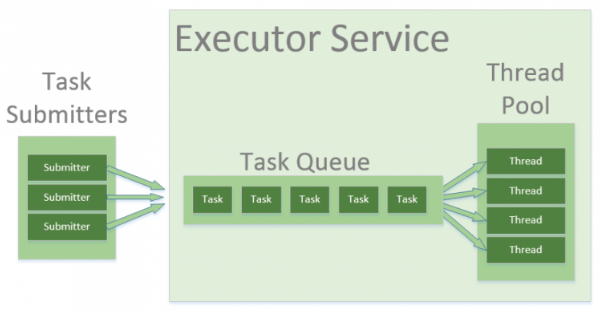
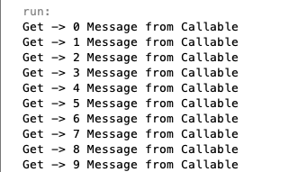
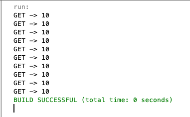
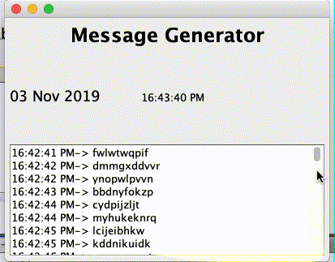

# Thread Pool

## Tujuan

- Memahami konsep `Thread Pool`
- Dapat membuat `Thread Pool` menggunakan bahasa pemrograman Java
- Menerapkan `Thread Pool` untuk kasus-kasus dalam pemrograman jaringan

## Petunjuk

-   Awali setiap sebelum membuat projek dengan berdoa.
-	Baca dan pahami tujuan, dasar teori, dan latihan-latihan modul dengan baik.
-	Kerjakan tugas-tugas projek dengan baik, sabar dan jujur

### Ulasan Teori

#### Thread Pool
Ketika kita membuat aplikasi concurrent di Java langkah yang dilakukan adalah dengan membuat beberapa objek `Runnable`
dan membuat sebuah `Thread` juga untuk menjalankannya. Sebenarnya untuk menciptakan sebuah thread di Java adalah hal
yang mahal karena akan memakan resource yang tersedia, ketika kita membuat sebuah thread aplikasi yang kita buat akan
mengalami penurunan performa yang signifikan.

Misalkan aplikasi server seperti database atau web server akan menerima request dari banyak client, hal tersebut
tentunya membutuhkan banyak pemprosesan tetapi membutuhkan waktu yang singkat. Hal yang dapat kita lakukan dari kasus
tersebut adalah dengan membangun aplikasi server yang membuat sebuah thread baru ketika ada request dari client. Hal
tersebut bisa dilakukan, tetapi tidak menguntungkan atau maksimal karena ketika sebuah server menciptakan thread setiap
kali request akan membutuhkan waktu lebih dan akan menggunakan resource system yang lebih juga. Selain itu, mematikan
thread juga tidak mudah.

Sebuah thread yang aktif akan menggunakan resource system, sebuah JVM ketika sedang membuat terlalu banyak thread dalam 
waktu yang bersamaan dapat menimbulkan `system out of memory` sehingga aplikasi akan hang atau bahkan crash. Untuk
menanggulangi hal tersebut dibutuhkan limitasi jumlah thread yang akan dibuat dalam sebuah aplikasi.

`Thread Pool` akan menggunakan kembali thread sebelumnya yang telah diciptakan untuk menjalankan tugas saat ini, 
hal ini menawarkan sebuah solusi untuk permasalahan di atas. 

<figure style="text-align: center">
                  
                  <figcaption style="text-align: center">https://www.baeldung.com/thread-pool-java-and-guava</figcaption>
              </figure>

Beberapa istilah dari gambar di atas adalah sebagai berikut
1. `Task Submitters`, sebuah class biasa atau main thread yang berfungsi untuk memasukan antrian task atau tugas tertentu
ke dalam `Task Queue`.
2. `Executor Service`, bagian atau wadah yang di dalamnya sebuah `Task Queue` dan `Thread Pool`. Pada bagian ini disediakan
oleh Java pada paket `java.util.concurrent`
3. `Task Queue`, antrian task yang akan dikerjakan oleh thread
4. `Thread Pool`, kumpulan thread yang siap menjalankan task tertentu

Java menyediakan `Executor Framework`, yaitu sebuah interface pada `java.util.concurrent.Executors` yang menurunkan `interface ExecutorService` dan `ThreadPoolExecutor`

#### Methode Executor Thread Pool
1. `newFixedThreadPool(int n)`, membuat thread pool dengan jumlah yang telah ditentukan. `n` adalah jumlah thread yang
akan dibuat.
2. `newCachedThreadPool()`, membuat thread pool dengan jumlah thread sesuai dengan kebutuhan. Ketika menjalankan task
akan menggunakan thread yang sebelumnya ketika tersedia. 
3. `newSingleThreadExecutor()`, hanya membuat single thread.

> Khusus untuk `newCachedThreadPool()` tidak disarankan ketika task yang dijalankan terlalu lama, hal tersebut akan
>mengakibatkan system down karena terlalu banyak thread yang dibuat.

Langkah-langkah yang dapat dilakukan untuk menggunakan `Thread Pool` adalaha sebagai berikut
1. Buat sebuah task(objek `Runnable`) yang akan dieksekusi, kelas dengan yang mengimplement `interface Runnable`. 
2. Buat sebuah `Executor Pool` menggunakan `Executors`, instance variabel boleh menggunakan `ExecutorService` atau
 `ThreadPoolExecutor`. Ketika menggunakan `ThreadPoolExecutor` harus dilakukan casting seperti contoh di bawah ini
     ```java
    ThreadPoolExecutor executor = (ThreadPoolExecutor) Executors.newFixedThreadPool(2);
    ```
3. Lewatkan `Task` melalui `Executor Pool`
4. Jangan lupa untuk mematikan `Executor Pool`

#### `interface ScheduledExecutorService`
Merupakan sebuah `interface` yang digunakan untuk menjalankan task atau tugas dengan kebutuhan secara periode dan jeda
waktu tertentu setelah pendefinisian. Model thread yang dibuat mirip dengan `ExecutorService`, karena interface tersebut
merupakan turunannya. Contoh pendefinisiannya adalah sebagai berikut
   ```java
ScheduledExecutorService executorService = Executors.newSingleThreadScheduledExecutor();
   ```

##### Method `interface ScheduledExecutorService`
Method yang umumnya dapat digunakan pada `interface` tersebut adalah di bawah ini 
1. `public <V> ScheduledFuture<V> schedule(Callable<V> callable, long delay, TimeUnit unit)`, digunakan untuk
menjadwalkan task atau tugas dengan delay waktu tertentu. Task yang akan dijalankan dapat memiliki nilai kembali ketika
task selesai dijalankan.
2. `public ScheduledFuture<?> schedule(Runnable command, long delay, TimeUnit unit)`, digunakan untuk menjadwalkan task
dengan jeda atau delay tertentu. Task yang dijalankan tidak dapat mengembalikan nilai tertentu 
3. `public ScheduledFuture<?> scheduleAtFixedRate(Runnable command, long initialDelay, long period, TimeUnit unit)`, 
digunakan untuk menjadwalkan task dengan initial awal jeda dan periode waktu tertentu.
4. `public ScheduledFuture<?> scheduleWithFixedDelay(Runnable command, long initialDelay, long delay, TimeUnit unit)`, 
Sama dengan yang sebelumnya, bedanya adalah delay sudah pasti dan tidak bisa ditawar.

>Ketika menggunakan `scheduleAtFixedRate` masih ada toleransi ketika processor menjalankan task yang lama, artinya
>thread akan menunggu sampai proses tersebut selesai. Sementara, `scheduleWithFixedDelay` kita harus bisa
>mempertimbangkan execution time setiap task.

#### `interface Future` dan `Callable`
Ketika kita membuat sebuah task menggunakan `interface Runnable`, task tersebut tidak dapat mengembalikan nilai
kembalian ketika sudah selesai. Atau dengan kata lain ketika kita ingin memonitor task yang dijalankan, dapat 
menggunakan `interface Callable`, `interface` tersebut terletak di `java.util.concurrent.Callable`.

`interface Future` digunakan untuk menampung nilai kembali dari `interface Callable`, nilai yang ditampung atau yang
dapat dilewatkan pada `Callable` tidak hanya variabel biasa tetapi bisa sebuah objek.

#### `Library Guava`
Selain menggunakan interface atau class bawaan Java, sebenarnya [Google](https://github.com/google/guava) juga 
menyediakan `Library` untuk urusan concurrent. Ketika menggunakan maven dapat ditambahkan tag di bawah ini pada file
`pom.xml`, untuk versi terbaru bisa juga mencari di 
[Maven Central](https://search.maven.org/classic/#search%7Cgav%7C1%7Cg%3A%22com.google.guava%22%20AND%20a%3A%22guava%22).
```xml
<dependency>
    <groupId>com.google.guava</groupId>
    <artifactId>guava</artifactId>
    <version>19.0</version>
</dependency>
```

## Praktikum
### Praktikum 1
1. Buatlah kode seperti di bawah ini untuk membuat sebuah Thread dengan `implements Runnable`
    ```java
    public class Task implements Runnable {
    
        private String nama;
    
        public Task(String nama) {
            this.nama = nama;
        }
    
        @Override
        public void run() {
            for (int i = 0; i < 10; i++) {
                System.out.println("" + nama + " result: " + i);
                Long delay = (long) (Math.random() * 10);
                try {
                    TimeUnit.SECONDS.sleep(delay);
                } catch (InterruptedException ex) {
                    Logger.getLogger(Task.class.getName()).log(Level.SEVERE, null, ex);
                }
            }
        }
    
    }
    ```
2. Buatlah sebuah class, kemudian isikan methode `main()` menggunakan kode di bawah ini
    ```java
    ExecutorService executor = Executors.newSingleThreadExecutor();
            for (int i = 0; i < 10; i++) {
                Task t = new Task("Task " + i);
                executor.execute(t);
            }
            executor.shutdown();
    ```
3. Silakan jalankan kode yang telah Anda buat, amati dan pelajari hasilnya!
4. Ubah kode `ExecutorService executor = Executors.newSingleThreadExecutor()` menjadi 
`ExecutorService executor = Executors.newFixedThreadPool(5)`
5. Silakan jalankan kode yang telah Anda buat, bandingkan dengan yang sebelumnya apakah ada yang beda?

#### Pertanyaan
1. Apakah perbedaan fungsi `Thread.sleep(int milisecond)` dengan `TimeUnit.SECONDS.sleep(long timeout)`?
2. Ubah kode `ExecutorService executor = Executors.newFixedThreadPool(5)` menjadi 
`ExecutorService executor = Executors.newCachedThreadPool()` apakah ada pengaruhnya dan jelaskan!
3. Apakah perbedaan kode `ThreadPoolExecutor executor = (ThreadPoolExecutor) Executors.newFixedThreadPool(5)`
dengan `ExecutorService executor = Executors.newFixedThreadPool(5)`
 
#### Praktikum 2
1. Buatlah class sebagai berikut
    ```java
    public class Tist implements Callable<String> {
    
        private String name;
    
        public Tist(String name) {
            this.name = name;
        }
    
        @Override
        public String call() throws Exception {
            return name + " Message from Callable";
        }
    
    }
    ```
2. Buatlah sebuah kelas `Praktikum2`
3. Buatlah instance variabel `executor` dari `interface Executors` dengan jumlah thread fix 5
4. Submit task dari object Task sebanyak 10 kali dan ambil nilai kembalinya.
    Output yang diharapkan adalah sebagai berikut
        
     <figure style="text-align: center">
        
        <figcaption style="text-align: center">Output</figcaption>
      </figure>    

#### Pertanyaan
1. Silakan coba method `public V get(long timeout, TimeUnit unit)` untuk mendapatkan nilai kembalian dari objek
`Callable`. Perbedaannya apa dengan `get()`, tanpa parameter?
2. Ubah kode pada method `call()` kelas `Tist`, menjadi kode untuk menghitung nilai total dari 5 buah nilai, silakan
menggunakan perulangan untuk menghitungnya. Setelah diubah, lewatkan objek `Tist` sebanyak 10 kali sehingga outputnya
seperti di bawah ini
    <figure style="text-align: center">
        
        <figcaption style="text-align: center">Output</figcaption>
      </figure>

### Tugas
Buatlah program dengan fungsi dan tampilan seperti di bawah ini
<figure style="text-align: center">
    
    <figcaption style="text-align: center">Tugas</figcaption>
</figure>

Kebutuhan program di atas adalah
1. Dibuat menggunakan konsep thread pool
2. Tampilan untuk clock menggunakan thread pool, bukan schedulling
3. Tampilan untuk message generator menggunakan scheduling

_**Silakan kerjakan praktikum terlebih dahulu agar memahami konsep thread pool**_