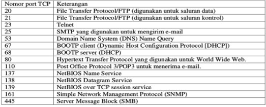
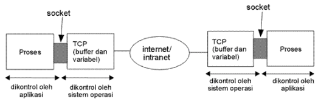

# Socket

## Tujuan

- Memahami penggunaan port
- Memahami dan menerapkan penggunaan socket untuk server dan client

## Petunjuk

- Awali setiap sebelum membuat projek dengan berdoa.
- Baca dan pahami tujuan, dasar teori, dan latihan-latihan modul dengan baik.
- Kerjakan tugas-tugas projek dengan baik, sabar dan jujur

### Ulasan Teori

#### Port
Nomor-nomor di bawah angka 1024 merupakan port yang umum digunakan dan ditetapkan oleh IANA (Internet Assigned Number 
Authority). Tabel berikut ini menyebutkan beberapa port TCP yang telah umum digunakan.

   <figure style="text-align: center">
                  
                  <figcaption style="text-align: center">Contoh Well Known Port</figcaption>
              </figure> 

#### Socket Untuk Client
Kelas `java.net.Socket` adalah kelas fundamental Java untuk melakukan operasi TCP client-side. Socket adalah sebuah 
abstraksi perangkat lunak yang digunakan sebagai suatu “terminal” dari suatu hubungan antara dua mesin atau proses yang 
saling berinterkoneksi. Di tiap mesin yang saling berinterkoneksi, harus terpasang socket.

Pada J2SE telah disediakan paket java.net yang berisi kelas- kelas dan interface yang menyediakan API (Application 
Programming Interface) level rendah (Socket, ServerSocket, DatagramSocket) dan level tinggi (URL, URLConnection).

Socket akan membangun komunikasi antar proses yang sama-sama aktif.
Ilustrasinya adalah sebagai berikut:

   <figure style="text-align: center">
                  
                  <figcaption style="text-align: center">Ilustrasi Penggunaan Socket</figcaption>
              </figure>

Kelas `java.net.ServerSocket` digunakan oleh Server untuk listen koneksi, sedangkan `java.net.Socket` digunakan oleh Client 
untuk inisialisasi koneksi. Setelah client terkoneksi ke server dengan menggunakan Socket, maka ServerSocket akan 
mengembalikan status server ke client melalui koneksi yang terbentuk sebelumnya.

Untuk pemrograman `_Socket Connection Oriented_` menggunakan kelas `java.net.ServerSocket` dan `java.net.Socket`. Untuk 
pemrograman `_Socket Connectionless Oriented_` menggunakan kelas `java.net.DatagramSocket`.
Format dari `java.net.socket` sebagai berikut:
- `Socket(InetAddress address, int port);`
    Untuk membuat sebuah stream socket dan koneksi ke suatu nomor port pada sebuah computer yang memiliki alamat 
IP menggunakan perintah berikut:
- `Socket(String host, int port);`
Untuk membuat sebuah stream socket dan juga koneksi ke suatu port tertentu pada sebuah komputer berdasar namanya.
- `Socket(InetAddress address, int port, InetAddresslocalAddr, int localPort);`
- `Socket(String host, int port, InetAddress localAddr, int localPort);`

Membuat sebuah socket dan mengkoneksikannya ke port yang dituju pada alamat IP yang disebutkan pada parameter address 
atau nama host. Selain itu juga akan dilakukan bind socket ke alamat lokal dan port lokal. (Hal ini dilakukan jika 
koneksi antara client dan server membutuhkan nomor port yang sudah ditentukan.
- `getInetAddress();`
    Untuk mendapatkan nama host yang dituju dan alamat Ipnya
- `getPort();`
    Untuk mendapatkan nomor remote host
- `getLocalPort();`
    Untuk mendapatkan nomor port localhost
- `getLocalAddress();`
    Untuk mendapatkan alamat local dimana socket digunakan
`- getInputStream();`
    Mengembalikan objek input stream dari socket
`- getOutputStream();`
    Mengembalikan objek output stream ke socket
- `setSoTimeout(int timeout);`
- `getSoTimeOut();`

Kedua method tersebut digunakan untuk memberi (set) dan mengambil (get) nilai opsi Socket untuk time out block 
(dalam milidetik) reading dari socket (SO_TIMEOUT). Jika dalam waktu timeout tidak mendapat suatu nilai maka, akan 
dilemparkan ke exception `java.net.SocketTimeoutException`. Nilai default timeoutnya adalah 0, yang berarti tanpa batas.
`setTCPNoDelay(boolean on);`
`getTCPNoDelay();`

Kedua method ini digunakan untuk memberi dan mengambil nilai opsi Socket TCP_NODELAY, yaitu untuk mengaktifkan atau 
menonaktifkan Algoritma Nagle (RFC 896), yaitu algoritma yang membuat TCP lebih efisien dalam konsumsi bandwidth dengan 
cara memperlambat penulisan data dalam ukuran yang kecil sehingga data-data yang ada dapat terkirimkan dalam suatu paket 
dengan ukuran besar. Nilai default opsi ini adalah aktif. Namun jika diinginkan adanya pengurangan network latency 
(waktu delay dalam pengiriman paket) dan meningkatkan unjuk kerja, maka opsi ini harus di nonaktifkan (di set dengan 
nilai false), namun akibatnya konsumsi bandwidth akan bertambah besar.
- `setSoLinger(boolean on, int linger);`
- `getSoLinger();`

Method tersebut akan mengaktifkan (true) atau menonaktifkan (false) opsi SO_LINGER dengan nilai waktu linger dalam 
milidetik. Opsi ini berpengaruh ketika socket ditutup, yaitu menentukan nilai waktu maksikum koneksi yang masih akan 
dipertahankan sampai socket koneksi benar-bernar ditutup. Hal ini berguna untuk mengirim dan memberikan ACK 
(acknowledge) terhadap data yang belum terkirim.
- `setSendBufferSize(int size);`
- `getSendBufferSize();`

Method ini akan mengatur dan mengambil informasi tentang ukuran buffer SO_SNDBUF, yaitu buffer untuk mengiriman. 
Ukuran ini juga harus disesuaikan ukuran buffer pada level network.
- `setReceiveBufferSize(int size);`
- `getReceiveBufferSize();`
Method ini digunakan jika Anda ingin mengatur ukuran buffer SO_RCVBUF, yaitu buffer yang digunakan untuk menampung paket 
yang masuk. Ukuran buffer ini juga digunakan untuk mengatur ukuran window yang diterapkan oleh TCP untuk flow controlnya 
(sliding window). Dalam pemanfaatan opsi ini, perlu dipastikan antara RCVBUF client dengan server ada sinkronisasi, 
sehingga sebelum server membind port yang akan digunakan ke socket (TCP) ataupun sebelum client membuka koneksi ke 
server, terlebih dahulu opsi ini harus di atur, jika Anda ingin mengaturnya.

#### Socket untuk Server
Kelas ServerSocket berisi semua yang diperlukan untuk menulis server di Java. Ini memiliki konstruktor yang membuat 
objek baru ServerSocket, metode yang mendengarkan koneksi pada port tertentu, metode yang mengkonfigurasi opsi server 
berbagai soket, dan bermacam-macam metode biasa seperti `toString()`.
Dalam pemrograman java siklus hidup dasar dari suatu program server adalah:
1.	Sebuah ServerSocket yang baru dibuat pada sebuah port tertentu menggunakan konstruktor `ServerSocket()`.
2.	ServerSocket mendengarkan upaya koneksi masuk pada port menggunakan metode `accept()`.
3.	Tergantung pada jenis server, baik `getInputStream()`, `getOutputStream()`, atau keduanya dipanggil untuk 
mendapatkan input dan output stream yang berkomunikasi dengan klien.
4.	Server dan klien berinteraksi sesuai dengan yang telah disepakati protokol sampai
5.	Menutup koneksi.
6.	Server, klien, atau keduanya menutup koneksi.
7.	Server kembali ke langkah 2 dan menunggu sambungan berikutnya.

## Langkah-langkah Praktikum
### Praktikum 1
Pada praktikum yang pertama adalah membuat program yang sederhana menggunakan socket, dimana sebuah client akan
mengirimkan sebuah pesan ke server. Setelah client mendapatkan pesan, maka client dan server akan berhenti atau kedua
aplikasi akan keluar. 
#### Socket untuk Client
Class `GreetClient` adalah contoh class yang digunakan oleh client untuk berkomunikasi dengan server, yaitu dengan
mengirimkan pesan ke sever.
```java
public class GreetClient {

    private Socket clientSocket;
    private PrintWriter out;
    private BufferedReader in;

    public void startConnection(String ip, int port) {
        try {
            clientSocket = new Socket(ip, port);
            out = new PrintWriter(clientSocket.getOutputStream(), true);
            in = new BufferedReader(new InputStreamReader(clientSocket.getInputStream()));
        } catch (IOException ex) {
            Logger.getLogger(GreetClient.class.getName()).log(Level.SEVERE, null, ex);
        }
    }

    public String sendMessage(String msg) {
        String resp = null;
        try {
            out.println(msg);
            resp = in.readLine();
        } catch (IOException ex) {
            Logger.getLogger(GreetClient.class.getName()).log(Level.SEVERE, null, ex);
        }
        return resp;
    }

    public void stopConnection() {
        try {
            in.close();
            out.close();
            clientSocket.close();
        } catch (IOException ex) {
            Logger.getLogger(GreetClient.class.getName()).log(Level.SEVERE, null, ex);
        }
    }
}
```

#### Socket untuk Server
Class `EchoServer` adalah class untuk menerima atau membaca stream/data dari client, setelah server menerima pesan dari
client maka server akan mengirimkan atau forward pesan tersebut ke client. Ketika client mengirimkan pesan ".", maka
server akan keluar.
```java
public class EchoServer {

    private ServerSocket serverSocket;
    private Socket clientSocket;
    private PrintWriter out;
    private BufferedReader in;

    public void start(int port) {
        try {
            serverSocket = new ServerSocket(port);
            clientSocket = serverSocket.accept();
            out = new PrintWriter(clientSocket.getOutputStream(), true);
            in = new BufferedReader(new InputStreamReader(clientSocket.getInputStream()));

            String inputLine;
            while ((inputLine = in.readLine()) != null) {
                if (".".equals(inputLine)) {
                    out.println("good bye");
                    break;
                }
                out.println(inputLine);
            }
        } catch (IOException ex) {
            Logger.getLogger(EchoServer.class.getName()).log(Level.SEVERE, null, ex);
        }
    }
    
    public void stop() {
        try {
            in.close();
            out.close();
            clientSocket.close();
            serverSocket.close();
        } catch (IOException ex) {
            Logger.getLogger(GreetServer.class.getName()).log(Level.SEVERE, null, ex);
        }
    }

    public static void main(String[] args) {
        EchoServer server = new EchoServer();
        server.start(6666);
    }
}
```
Selanjutnya untuk mencoba contoh kode di atas, buatlah class dan method main yang berisi potongan kode seperti di bawah 
ini. Jangan lupa server juga harus terlebih dahulu dijalankan.
```java
GreetClient client = new GreetClient();
client.startConnection("127.0.0.1", 6666);
String response = client.sendMessage("hello server");
System.out.println("" + response);
```

#### Pertanyaan
1. Setelah menjalankan potongan kode di atas, apakah yang dapat Anda simpulkan?
2. Buatlah kode untuk melakukan scan range port pada komputer Anda?

### Praktikum 2
Pada praktikum yang kedua, akan dicontoh sebuah kode untuk server agar dapat menerima request dari banyak client. 
Agar dapat menerima request dari banyak client, maka dibutuhkan sebuah `Thread`. Kodenya adalah di bawah ini
```java
public class EchoMultiServer {

    private ServerSocket serverSocket;

    public void start(int port) {
        try {
            System.out.println("Starting server on port "+port);
            serverSocket = new ServerSocket(port);
            while (true) {
                new EchoClientHandler(serverSocket.accept()).start();
            }
        } catch (IOException ex) {
            Logger.getLogger(EchoMultiServer.class.getName()).log(Level.SEVERE, null, ex);
        }
    }

    public void stop() {
        try {
            serverSocket.close();
        } catch (IOException ex) {
            Logger.getLogger(EchoMultiServer.class.getName()).log(Level.SEVERE, null, ex);
        }
    }

    private static class EchoClientHandler extends Thread {

        private Socket clientSocket;
        private PrintWriter out;
        private BufferedReader in;

        public EchoClientHandler(Socket socket) {
            this.clientSocket = socket;
        }

        public void run() {
            try {
                out = new PrintWriter(clientSocket.getOutputStream(), true);
                in = new BufferedReader(
                        new InputStreamReader(clientSocket.getInputStream()));

                String inputLine;
                while ((inputLine = in.readLine()) != null) {
                    if (".".equals(inputLine)) {
                        out.println("bye");
                        break;
                    }
                    out.println(inputLine);
                }

                in.close();
                out.close();
                clientSocket.close();
            } catch (IOException ex) {
                Logger.getLogger(EchoMultiServer.class.getName()).log(Level.SEVERE, null, ex);
            }
        }
    }
    
    public static void main(String[] args) {
        EchoMultiServer server = new EchoMultiServer();
        server.start(6666);
    }
}
```
Untuk kode client, masih sama dengan yang sebelumnya. Untuk mencoba code server tersebut buatlah class yang didalamnya
terdapat method main, potongan kodenya adalah di bawah ini
```java
GreetClient client1 = new GreetClient();
client1.startConnection("127.0.0.1", 6666);
String response = client1.sendMessage("holla server");
String response1 = client1.sendMessage("hoe server");
String endMessage = client1.sendMessage(".");
System.out.println("" + response);
System.out.println("" + response1);
System.out.format("%s", endMessage);
```

#### Pertanyaan
1. Setelah menjalankan potongan kode di atas, apakah yang dapat Anda simpulkan?
2. Silakan modifikasi pada method main yang sebelumnya telah Anda buat, buatlah instance client lebih dari 1!
3. Pada class di atas masih menggunakan `Thread` biasa, ganti menggunakan `Thread Pool`!

## Tugas

_**Silakan kerjakan praktikum terlebih dahulu agar memahami konsep socket**_

Buatlah aplikasi chat client seperti tampilan di bawah ini
<figure style="text-align: center">
                  
                  <figcaption style="text-align: center">Tugas Socket</figcaption>
              </figure>
