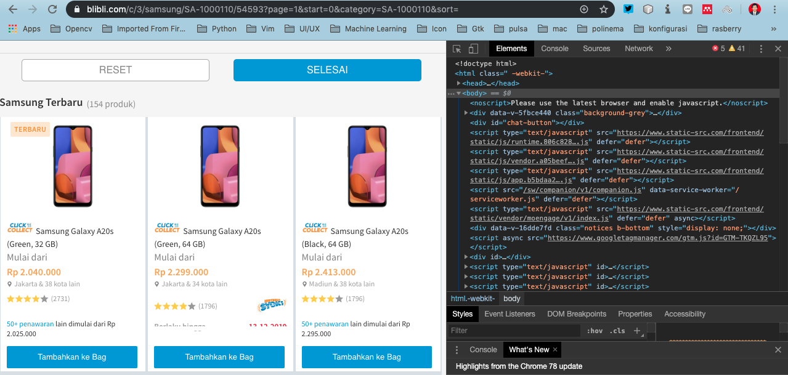
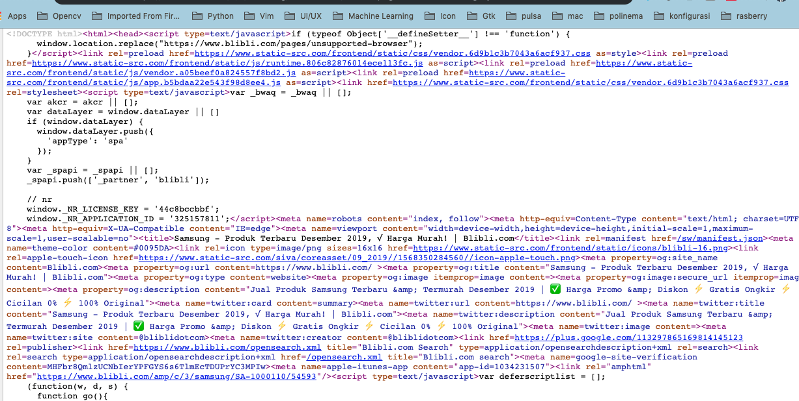

# UNIFORM RESOURCE LOCATOR

## Tujuan

-	Memahami dan mengerti tentang URL
-	Menerapkan komunikasi multicast pada aplikasi   

## Petunjuk

- Awali setiap sebelum membuat projek dengan berdoa.
- Baca dan pahami tujuan, dasar teori, dan latihan-latihan modul dengan baik.
- Kerjakan tugas-tugas projek dengan baik, sabar dan jujur

### Ulasan Teori

#### Kelas URL
Kelas URL adalah cara paling sederhana untuk sebuah program Java untuk menemukan dan mengambil data dari jaringan. Anda 
tidak perlu khawatir tentang rincian protokol yang digunakan, format data yang diambil, atau bagaimana berkomunikasi 
dengan server, anda cukup memberitahu URL dan mendapatkan data untuk Anda. 
  
Kelas `java.net.URL` adalah sebuah abstraksi dari Uniform Resource Locator (URL) seperti http://www.hamsterdance.com/ 
atau ftp://ftp.redhat.com/pub/.  Listing program berikut adalah contoh penggunaan kelas URL yang meliputi pengecekan 
URL dan berbagai cara penulisannya menggunakan kelas URL. 

URL terdiri dari lima bagian, yaitu Skema atau dikenal sebagai protokol, kewenangan, path, fragmen pengenal, juga 
dikenal sebagai bagian atau  ref serta string query. Contohnya adalah sebagai berikut: 
 	http://java.sun.com:80/docs/books/tutorial/index.html#DOWNLOADING 
 Contoh penerapannya adalah sebagai berikut:
```java
public class urltest1 { 
  public static void main (String args[]) { 
    URL webURL, ftpURL; 
    try { 
      webURL = new URL("http://www.macfaq.com/vendor.html"); 
      System.out.println(webURL); 
      ftpURL = new URL("ftp://ftp1.macfaq.com/pub/"); 
      System.out.println(ftpURL); 
    } 
    catch (MalformedURLException e)  { 
      System.err.println("URL Salah"); 
    } 
  } 
}
``` 

#### Koneksi URL
`URLConnection` adalah kelas abstrak yang merupakan sambungan aktif ke sumber daya yang ditentukan oleh URL. Kelas 
`URLConnection` memiliki dua tujuan yang berbeda tetapi terkait. 

Pertama, memberikan kontrol lebih besar atas interaksi dengan server (terutama server HTTP) daripada kelas URL. Dengan 
`URLConnection`, Anda dapat memeriksa header yang dikirimkan oleh server dan respon yang sesuai. Anda dapat mengatur field
 header yang digunakan dalam permintaan klien. Anda dapat menggunakan URLConnection untuk men-download file biner. 
Akhirnya, URLConnection sebuah memungkinkan Anda mengirim data kembali ke server web dengan POST atau GET dan 
menggunakan metode permintaan HTTP yang lain.

### Langkah-langkah Praktikum
Untuk membuat sebuah program yang menggunakan kelas URLConnection diperlukan urutan langkah-langkah dasar sebagai berikut: 
1.	Buatlah objek URL. 
2.	Panggil metode `openConnection()` untuk mengambil objek `URLConnection` dari suatu URL. 
3.	Mengkonfigurasi `URLConnection` tersebut. 
4.	Baca field header. 
5.	Dapatkan input stream dan membaca data. 
6.	Dapatkan output stream dan menulis data. 
7.	Menutup koneksi. 
8.	Tulislah program berikut: 
```java
public class URLConnectionReader  
{ 
    public static void main(String[] args) throws Exception  
    {   
        URL alamat = new URL("https://www.polinema.ac.id/"); 
        URLConnection yc = alamat.openConnection(); 
        BufferedReader in = new BufferedReader( 
                                new InputStreamReader( 
                                yc.getInputStream())); 
        String inputLine; 
 
        while ((inputLine = in.readLine()) != null)  
            System.out.println(inputLine);

        in.close(); 
    } 
}
```

#### Crawling atau scraping website
Pada praktikum selanjutnya kita akan mencoba mengambil data dari sebuah website e-commerce
1. Buka halaman https://www.blibli.com/
2. Kemudian pilih kategori tertentu, pada contoh kali ini kategorinya adalah `handphone` dengan merk `samsung`
3. Silakan `inspect element` halaman website tersebut, ketika menggunakan `Chrome(View - Developer - Developer Tool)`
    <figure style="text-align: center">
                      
                      <figcaption style="text-align: center">Inspect Element</figcaption>
                  </figure>

    >Tetapi sayangnya, kita tidak bisa langsung melakukan crawling url tersebut. Karena sama blibli diarahkan ke halaman
    tertentu ketika akan mengaksesnya.

4. Silakan lihat tampilkan code pada halaman tersebut dengan `klik kanan - View Page Source`, tampilan seperti berikut ini
    <figure style="text-align: center">
                      
                      <figcaption style="text-align: center">Page Source</figcaption>
                  </figure>
5. Pada halaman tersebut url yang mengarahkan ke produk samsung yaitu `https://www.blibli.com/amp/c/3/samsung/SA-1000110/54593`.
Silakan paste halaman tersebut ke browser Anda, seharusnya akan tampil beberapa produknya, kemudian `View Page Source` 
kembali untuk memastikan apakah sudah bisa dilakukan `crawling atau scraping`
6. Untuk memudahkan scraping kita membutuhkan library yaitu `jsoup`, silakan download di `https://jsoup.org/download` kemudian pasang library tersebut
pada editor Anda. Versi yang terakhir pada jobsheet ini adalah `1.12.1`.
Ketika menggunakan maven bisa menambah tag seperti ini pada file `pom.xml`

    ```xml
    <dependency>
      <!-- jsoup HTML parser library @ https://jsoup.org/ -->
      <groupId>org.jsoup</groupId>
      <artifactId>jsoup</artifactId>
      <version>1.12.1</version>
    </dependency>
    ```

    Atau kalau Gradle `compile 'org.jsoup:jsoup:1.12.1'`

7. Buat kode seperti di bawah ini
```java
try {
//            String url = "https://www.blibli.com/c/3/samsung/SA-1000110/54593?page=1"
//                    + "&start=0&category=SA-1000110&sort=";
            String url = "https://www.blibli.com/amp/c/3/samsung/SA-1000110/54593";
            Validate.isTrue(true, "URL " + url + " tidak dapat diakses");
            System.out.println("Fetching " + url + " ...");
            Document document = Jsoup.connect(url).get();
            Elements div = document.select("div.product-item");
            div.stream().forEach(el -> {
                Elements allElements = el.getAllElements();
                for (int i = 0; i < allElements.size(); i++) {
                    switch (i) {
                        case 2://image
                            System.out.println("" + allElements.get(i).attr("src"));
                            break;
                        case 3://detail
                            System.out.println("" + allElements.get(i).text());
                            break;
                        case 5://harga
                            System.out.println("" + allElements.get(i).text());
                            break;
                        case 7://produk yang sama
                            System.out.println("" + allElements.get(i).text());
                            break;
                        case 15://komentar
                            System.out.println("" + allElements.get(i).text());
                            break;
                    }

                }
            });
        } catch (IOException ex) {
            Logger.getLogger(BliBliScrapper.class.getName()).log(Level.SEVERE, null, ex);
        }
```
Pada kode di atas terdapat baris perintah `document.select("div.product-item")`, digunakan untuk mengambil element
dengan tag `div` dan `class product-item`. Untuk dapat menggunakan jsoup secara mendalam bisa mengunjungi halaman 
`https://jsoup.org/cookbook/`

##### Pertanyaan
Silakan cari website e-commerce yang lain, kemudian lakukan `crawling` agar lebih faham menggunakan jsoup


